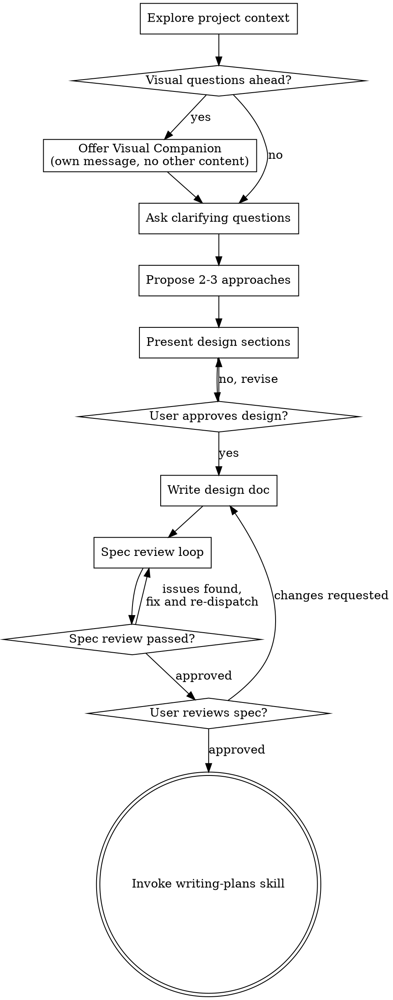

# Conversation Transcript

**Date:** Saturday, April 11, 2026 at 3:30 PM -03
**Project:** SuperMac
**Session:** `7ac90606-013...`

---

## User

<local-command-caveat>Caveat: The messages below were generated by the user while running local commands. DO NOT respond to these messages or otherwise consider them in your response unless the user explicitly asks you to.</local-command-caveat>

## User

<command-name>/clear</command-name>
            <command-message>clear</command-message>
            <command-args></command-args>

## User

<command-message>previous-output</command-message>
<command-name>/previous-output</command-name>
<command-args>"⏺ All session metadata and the built binary. No source code. CCS is correct — docs-only.

⏺ Phase 1.5-1.8: Skipped — remaining changes are docs/metadata only. Code was already committed in the 4 semantic
  commits.

  Phase 2: Commit — already done via /commit-all.

⏺ 阶段 3: 并行执行

⏺ Bash(ccs session-end-post --json 2>&1 | head -30)
  ⎿  {
       "session_audit": {
         "issues_flagged": 0,
     … +27 lines (ctrl+o to expand)

⏺ Bash(ccs doc-audit --json 2>&1 | head -20)
  ⎿  scanning Go commands: reading cmd dir /Users/gab/PROJECTS/SuperMac/tools/ccsession/cmd: open /Users/gab/
     PROJECTS/SuperMac/tools/ccsession/cmd: no such file or directory

⏺ Bash(ccs roadmap reconcile --json 2>&1 | head -20)
  ⎿  {
       "candidates": []
     }

⏺ Now dispatch background agents for session summary and continuation prompt.

⏺ 2 background agents launched (↓ to manage)
   ├─ Write session summary
   └─ Write continuation prompt

⏺ Phase 3 agents dispatched in background. Moving to Phase 4 while they work.

  Phase 4: Release Decision

⏺ Bash(ccs version --release-check --json 2>&1)
  ⎿  {
       "has_tags": true,
       "last_tag": "v0.1.2",
     … +14 lines (ctrl+o to expand)

⏺ All conditions met. 7 feat commits since v0.1.2. Suggested: minor bump.

  But this is the SuperMac project — the version is in CHANGELOG.md, not managed by ccs version. The Go binary
  uses ldflags. Let me skip the automated bump and defer to the next session when we tag v0.2.0 properly.

⏺ Phase 4: Release ready — 7 feat commits since v0.1.2. Deferring the actual tag to next session so we can
  validate CI first.

  Waiting for background agents to complete before Phase 6...

✻ Crunched for 3m 40s · 1 local agent still running

⏺ Agent "Write session summary" completed

⏺ Session summary agent done. Let me commit it.

⏺ Bash(git -C /Users/gab/PROJECTS/SuperMac add
      docs/sessions/Session-2026-04-10-supermac-distribution-dependency.md && git -C /Users/gab/PROJECTS/SuperMac
      commit -m "$…)
  ⎿  🔍 Checking for Claude Code command/agent changes...
     [master 7051982] docs: add session summary for distribution + dependency system
      1 file changed, 57 insertions(+)
      create mode 100644 docs/sessions/Session-2026-04-10-supermac-distribution-dependency.md

⏺ Waiting for continuation prompt agent...

✻ Brewed for 32s · 1 local agent still running

⏺ Agent "Write continuation prompt" completed

⏺ Bash(git -C /Users/gab/PROJECTS/SuperMac add docs/prompts/2026-04-10-release-and-distribution-finalization.md &&
       git -C /Users/gab/PROJECTS/SuperMac commit -m "$(cat…)
  ⎿  🔍 Checking for Claude Code command/agent changes...
     [master 94916bf] docs: add continuation prompt for release finalization
      1 file changed, 126 insertions(+)
      create mode 100644 docs/prompts/2026-04-10-release-and-distribution-finalization.md

⏺ Phase 3 complete:
  - Post-audit: readiness score 85
  - Doc gaps: none (Go commands not in this project)
  - Roadmap: 0 superseded items
  - Session summary: committed 7051982
  - Continuation prompt: committed 94916bf

  Phase 6: Finalize

⏺ Bash(ccs session-end-finalize 2>&1)
  ⎿  {
       "success": false,
       "steps": [
     … +18 lines (ctrl+o to expand)

⏺ Bash(cosmohooks mark-session-end 2>&1)
  ⎿  (No output)

⏺ Finalize ran into a non-critical issue (tried to stage docs/ideas/ which doesn't exist). The important bits
  succeeded — session-end marked.

⏺ ---
  Session End Complete

  Phase 0+1: Pre-commit hygiene        ✅ docs-only profile
  Phase 1.5: Code simplification       ⏭️ skipped (docs-only)
  Phase 1.75: Verification              ⏭️ skipped (docs-only)
  Phase 1.8: Code review                ⏭️ skipped (docs-only)
  Phase 2:   Commit changes             ✅ 4 commits via /commit-all
  Phase 3:   Parallel blast             ✅ summary + continuation prompt
  Phase 4:   Release decision           ⏳ deferred (validate CI first)
  Phase 6:   Finalize                   ✅ session-end marked

  6 commits on master this session:
  94916bf docs: add continuation prompt for release finalization
  7051982 docs: add session summary for distribution + dependency system
  8284d35 docs: rewrite README for Go rewrite, add INSTALL.md, update roadmap
  506e64c test(supermac-go): add 52 unit tests across 10 modules
  7f3076d feat(supermac-go): add declarative dependency system with auto-install and mac doctor
  6b59845 feat(supermac-go): add distribution CI/CD, install script, and Homebrew formula

  Next session: /run-continuation docs/prompts/2026-04-10-release-and-distribution-finalization.md

✻ Worked for 1m 24s

❯ did we never run /project-init properly on this repo? We can do that in the next chat if we havent?

  Listed 1 directory (ctrl+o to expand)

❯ the full version I mean

⏺ No — only session-end-state.json in .claude/. No project config, no settings, no project-init artifacts. The
  full /project-init was never run here.

  Next session we can run it. It'll set up the .claude/ directory properly with project-specific config, settings,
   and any hooks SuperMac needs. Good call — should have been done day one.

✻ Crunched for 31s

❯ ok update the   Next session: /run-continuation
docs/prompts/2026-04-10-release-and-distribution-finalization.md for us to do that asap

  Read 1 file (ctrl+o to expand)

⏺ Update(docs/prompts/2026-04-10-release-and-distribution-finalization.md)
  ⎿  PreToolUse:Edit hook returned blocking error          ⎿  BLOCKED: Cannot edit prompt file frontmatter
                                                              directly.

                                                              Use ccs prompts commands instead:
                                                                ccs prompts complete <file>   # Mark as COMPLETED
                                                                ccs prompts start <file>      # Mark as STARTED
                                                                ccs prompts set-status <file> <status>

                                                              This ensures proper tracking and status
                                                              synchronization.
                                                              Content edits (outside frontmatter) are allowed.
  ⎿  Error: Hook PreToolUse:Edit denied this tool

⏺ Bash(ccs prompts set-status docs/prompts/2026-04-10-release-and-distribution-finalization.md PENDING 2>&1)
  ⎿  Running…

✶ Orbiting… (52s · ↓ 196 tokens)

──────────────────────────────────────────────────────────────────────────────────────────────────────────────────
❯
──────────────────────────────────────────────────────────────────────────────────────────────────────────────────
  🟡SuperMac/master v0.1.2 (build #44) │ GLM 5.1 ⏱ 2d │ 🌳:0/1 …  Context low (2% remaining) · Run /compact to co…
  ⏵⏵ accept edits on (shift+tab to cycle)
╭─── Claude Code v2.1.92 ────────────────────────────────────────────────────────────────────────────────────────╮
│                                                    │ Tips for getting started                                  │
│                  Welcome back GΛB!                 │ Run /init to create a CLAUDE.md file with instructions for│
│                                                    │ ──────────────────────────────────────────────────────────│
│                       ▐▛███▜▌                      │ Recent activity                                           │
│                      ▝▜█████▛▘                     │ No recent activity                                        │
│                        ▘▘ ▝▝                       │                                                           │
│   glm-5.1 with high effort · API Usage Billing ·   │                                                           │
│   payments@cosmolabs.org's Organization            │                                                           │
│                 ~/PROJECTS/SuperMac                │                                                           │
╰────────────────────────────────────────────────────────────────────────────────────────────────────────────────╯

⏺ Now dispatch background agents for session summary and continuation prompt.

⏺ 2 background agents launched (↓ to manage)
   ├─ Write session summary
   └─ Write continuation prompt

⏺ Phase 3 agents dispatched in background. Moving to Phase 4 while they work.

  Phase 4: Release Decision

⏺ Bash(ccs version --release-check --json 2>&1)
  ⎿  {
       "has_tags": true,
       "last_tag": "v0.1.2",
     … +14 lines (ctrl+o to expand)

⏺ All conditions met. 7 feat commits since v0.1.2. Suggested: minor bump.

  But this is the SuperMac project — the version is in CHANGELOG.md, not managed by ccs version. The Go binary
  uses ldflags. Let me skip the automated bump and defer to the next session when we tag v0.2.0 properly.

⏺ Phase 4: Release ready — 7 feat commits since v0.1.2. Deferring the actual tag to next session so we can
  validate CI first.

  Waiting for background agents to complete before Phase 6...

✻ Crunched for 3m 40s · 1 local agent still running

⏺ Agent "Write session summary" completed

⏺ Session summary agent done. Let me commit it.

⏺ Bash(git -C /Users/gab/PROJECTS/SuperMac add
      docs/sessions/Session-2026-04-10-supermac-distribution-dependency.md && git -C /Users/gab/PROJECTS/SuperMac
      commit -m "$…)
  ⎿  🔍 Checking for Claude Code command/agent changes...
     [master 7051982] docs: add session summary for distribution + dependency system
      1 file changed, 57 insertions(+)
      create mode 100644 docs/sessions/Session-2026-04-10-supermac-distribution-dependency.md

⏺ Waiting for continuation prompt agent...

✻ Brewed for 32s · 1 local agent still running

⏺ Agent "Write continuation prompt" completed

⏺ Bash(git -C /Users/gab/PROJECTS/SuperMac add docs/prompts/2026-04-10-release-and-distribution-finalization.md &&
       git -C /Users/gab/PROJECTS/SuperMac commit -m "$(cat…)
  ⎿  🔍 Checking for Claude Code command/agent changes...
     [master 94916bf] docs: add continuation prompt for release finalization
      1 file changed, 126 insertions(+)
      create mode 100644 docs/prompts/2026-04-10-release-and-distribution-finalization.md

⏺ Phase 3 complete:
  - Post-audit: readiness score 85
  - Doc gaps: none (Go commands not in this project)
  - Roadmap: 0 superseded items
  - Session summary: committed 7051982
  - Continuation prompt: committed 94916bf

  Phase 6: Finalize

⏺ Bash(ccs session-end-finalize 2>&1)
  ⎿  {
       "success": false,
       "steps": [
     … +18 lines (ctrl+o to expand)

⏺ Bash(cosmohooks mark-session-end 2>&1)
  ⎿  (No output)

⏺ Finalize ran into a non-critical issue (tried to stage docs/ideas/ which doesn't exist). The important bits
  succeeded — session-end marked.

⏺ ---
  Session End Complete

  Phase 0+1: Pre-commit hygiene        ✅ docs-only profile
  Phase 1.5: Code simplification       ⏭️ skipped (docs-only)
  Phase 1.75: Verification              ⏭️ skipped (docs-only)
  Phase 1.8: Code review                ⏭️ skipped (docs-only)
  Phase 2:   Commit changes             ✅ 4 commits via /commit-all
  Phase 3:   Parallel blast             ✅ summary + continuation prompt
  Phase 4:   Release decision           ⏳ deferred (validate CI first)
  Phase 6:   Finalize                   ✅ session-end marked

  6 commits on master this session:
  94916bf docs: add continuation prompt for release finalization
  7051982 docs: add session summary for distribution + dependency system
  8284d35 docs: rewrite README for Go rewrite, add INSTALL.md, update roadmap
  506e64c test(supermac-go): add 52 unit tests across 10 modules
  7f3076d feat(supermac-go): add declarative dependency system with auto-install and mac doctor
  6b59845 feat(supermac-go): add distribution CI/CD, install script, and Homebrew formula

  Next session: /run-continuation docs/prompts/2026-04-10-release-and-distribution-finalization.md

✻ Worked for 1m 24s

❯ did we never run /project-init properly on this repo? We can do that in the next chat if we havent?

  Listed 1 directory (ctrl+o to expand)

❯ the full version I mean

⏺ No — only session-end-state.json in .claude/. No project config, no settings, no project-init artifacts. The
  full /project-init was never run here.

  Next session we can run it. It'll set up the .claude/ directory properly with project-specific config, settings,
   and any hooks SuperMac needs. Good call — should have been done day one.

✻ Crunched for 31s

❯ ok update the   Next session: /run-continuation
docs/prompts/2026-04-10-release-and-distribution-finalization.md for us to do that asap

  Read 1 file (ctrl+o to expand)

⏺ Update(docs/prompts/2026-04-10-release-and-distribution-finalization.md)
  ⎿  PreToolUse:Edit hook returned blocking error          ⎿  BLOCKED: Cannot edit prompt file frontmatter
                                                              directly.

                                                              Use ccs prompts commands instead:
                                                                ccs prompts complete <file>   # Mark as COMPLETED
                                                                ccs prompts start <file>      # Mark as STARTED
                                                                ccs prompts set-status <file> <status>

                                                              This ensures proper tracking and status
                                                              synchronization.
                                                              Content edits (outside frontmatter) are allowed.
  ⎿  Error: Hook PreToolUse:Edit denied this tool

⏺ Bash(ccs prompts set-status docs/prompts/2026-04-10-release-and-distribution-finalization.md PENDING 2>&1)
  ⎿  ✅ Status updated: ⏳ PENDING

⏺ Now add the project-init goal to the content (non-frontmatter edits are allowed).

  Read 1 file (ctrl+o to expand)

⏺ Update(docs/prompts/2026-04-10-release-and-distribution-finalization.md)
  ⎿  Added 5 lines, removed 1 line
      53
      54  ## Goals
      55
      56 -### [ ] 1. Push to GitHub and verify CI passes
      56 +### [ ] 1. Run /project-init on SuperMac repo
      57
      58 +The SuperMac repo was never properly initialized with `/project-init`. Only `.claude/session-end-
         +state.json` exists — no project config, settings, or hooks. Run `/project-init` to set up the `.c
         +laude/` directory properly before proceeding with any other work. This should have been done day
         +one.
      59 +
      60 +### [ ] 2. Push to GitHub and verify CI passes
      61 +
      62  Push master to `origin` and confirm the CI workflow runs green:
      63  - `git push origin master`
      64  - Monitor the Actions tab: both `test` (go test + go vet) and `build` (arm64 + amd64 matrix) must
           pass

⏺ Now renumber the remaining goals 2-8 and update the priority order section.

  Read 1 file (ctrl+o to expand)
  ⎿  Context limit reached · /compact or /clear to continue
"</command-args>

## User

# Previous Output - Session Recovery & Continuation

Recover lost session context by combining pasted terminal output with internal memory. For pure internal recall without terminal output, use `/recall` instead.

## Usage

```bash
/previous-output                           # Inference from internal sources only
/previous-output "pasted terminal output"  # With terminal context
/previous-output --analyze-only            # Show context, don't continue
```

## Instructions

### Step 1: Gather Internal Context

Run `ccs recall --brief` to get baseline project state (branch, last session, prompt, uncommitted files, issues).

### Step 2: Parse Terminal Output (if provided)

If the user pasted terminal output, extract:
- File paths mentioned
- Commands that were running
- Error messages or stack traces
- TodoWrite task names
- Tool calls and their results

### Step 3: Cross-Reference

Compare terminal output insights with `ccs recall --brief` output:
- Do the mentioned files match uncommitted changes?
- Do the commands align with the active prompt's goals?
- Are there errors that explain why work stopped?

### Step 4: Synthesize "Aha Moment"

```
## Session Recovery

**Branch**: {branch}
**Last Activity**: {timestamp or "recently"}

### What We Were Working On
{1-3 sentences based on combined evidence}

### Evidence Found
- Internal: {recall brief summary}
- Terminal: {key findings from pasted output, if any}

### Likely Next Steps
1. {inferred next action}
2. {inferred next action}
```

### Step 5: Confirm & Continue

Unless `--analyze-only`:

```
---
Ready to continue? I'll pick up where we left off with {primary task}.

Type 'yes' to continue, or tell me what you'd like to focus on instead.
```

If user confirms, load any active continuation prompt and begin working.

## Key Principles

- **Be confident**: Present findings as "what we were doing" not "what might have happened"
- **Terminal output is bonus context**: Internal sources (via `ccs recall`) are the foundation
- **Seamless continuation**: If user says yes, immediately start working

## Related

`/recall` · `/continuation-prompt` · `/handoff` · `/session-end`


ARGUMENTS: "⏺ All session metadata and the built binary. No source code. CCS is correct — docs-only.

⏺ Phase 1.5-1.8: Skipped — remaining changes are docs/metadata only. Code was already committed in the 4 semantic
  commits.

  Phase 2: Commit — already done via /commit-all.

⏺ 阶段 3: 并行执行

⏺ Bash(ccs session-end-post --json 2>&1 | head -30)
  ⎿  {
       "session_audit": {
         "issues_flagged": 0,
     … +27 lines (ctrl+o to expand)

⏺ Bash(ccs doc-audit --json 2>&1 | head -20)
  ⎿  scanning Go commands: reading cmd dir /Users/gab/PROJECTS/SuperMac/tools/ccsession/cmd: open /Users/gab/
     PROJECTS/SuperMac/tools/ccsession/cmd: no such file or directory

⏺ Bash(ccs roadmap reconcile --json 2>&1 | head -20)
  ⎿  {
       "candidates": []
     }

⏺ Now dispatch background agents for session summary and continuation prompt.

⏺ 2 background agents launched (↓ to manage)
   ├─ Write session summary
   └─ Write continuation prompt

⏺ Phase 3 agents dispatched in background. Moving to Phase 4 while they work.

  Phase 4: Release Decision

⏺ Bash(ccs version --release-check --json 2>&1)
  ⎿  {
       "has_tags": true,
       "last_tag": "v0.1.2",
     … +14 lines (ctrl+o to expand)

⏺ All conditions met. 7 feat commits since v0.1.2. Suggested: minor bump.

  But this is the SuperMac project — the version is in CHANGELOG.md, not managed by ccs version. The Go binary
  uses ldflags. Let me skip the automated bump and defer to the next session when we tag v0.2.0 properly.

⏺ Phase 4: Release ready — 7 feat commits since v0.1.2. Deferring the actual tag to next session so we can
  validate CI first.

  Waiting for background agents to complete before Phase 6...

✻ Crunched for 3m 40s · 1 local agent still running

⏺ Agent "Write session summary" completed

⏺ Session summary agent done. Let me commit it.

⏺ Bash(git -C /Users/gab/PROJECTS/SuperMac add
      docs/sessions/Session-2026-04-10-supermac-distribution-dependency.md && git -C /Users/gab/PROJECTS/SuperMac
      commit -m "$…)
  ⎿  🔍 Checking for Claude Code command/agent changes...
     [master 7051982] docs: add session summary for distribution + dependency system
      1 file changed, 57 insertions(+)
      create mode 100644 docs/sessions/Session-2026-04-10-supermac-distribution-dependency.md

⏺ Waiting for continuation prompt agent...

✻ Brewed for 32s · 1 local agent still running

⏺ Agent "Write continuation prompt" completed

⏺ Bash(git -C /Users/gab/PROJECTS/SuperMac add docs/prompts/2026-04-10-release-and-distribution-finalization.md &&
       git -C /Users/gab/PROJECTS/SuperMac commit -m "$(cat…)
  ⎿  🔍 Checking for Claude Code command/agent changes...
     [master 94916bf] docs: add continuation prompt for release finalization
      1 file changed, 126 insertions(+)
      create mode 100644 docs/prompts/2026-04-10-release-and-distribution-finalization.md

⏺ Phase 3 complete:
  - Post-audit: readiness score 85
  - Doc gaps: none (Go commands not in this project)
  - Roadmap: 0 superseded items
  - Session summary: committed 7051982
  - Continuation prompt: committed 94916bf

  Phase 6: Finalize

⏺ Bash(ccs session-end-finalize 2>&1)
  ⎿  {
       "success": false,
       "steps": [
     … +18 lines (ctrl+o to expand)

⏺ Bash(cosmohooks mark-session-end 2>&1)
  ⎿  (No output)

⏺ Finalize ran into a non-critical issue (tried to stage docs/ideas/ which doesn't exist). The important bits
  succeeded — session-end marked.

⏺ ---
  Session End Complete

  Phase 0+1: Pre-commit hygiene        ✅ docs-only profile
  Phase 1.5: Code simplification       ⏭️ skipped (docs-only)
  Phase 1.75: Verification              ⏭️ skipped (docs-only)
  Phase 1.8: Code review                ⏭️ skipped (docs-only)
  Phase 2:   Commit changes             ✅ 4 commits via /commit-all
  Phase 3:   Parallel blast             ✅ summary + continuation prompt
  Phase 4:   Release decision           ⏳ deferred (validate CI first)
  Phase 6:   Finalize                   ✅ session-end marked

  6 commits on master this session:
  94916bf docs: add continuation prompt for release finalization
  7051982 docs: add session summary for distribution + dependency system
  8284d35 docs: rewrite README for Go rewrite, add INSTALL.md, update roadmap
  506e64c test(supermac-go): add 52 unit tests across 10 modules
  7f3076d feat(supermac-go): add declarative dependency system with auto-install and mac doctor
  6b59845 feat(supermac-go): add distribution CI/CD, install script, and Homebrew formula

  Next session: /run-continuation docs/prompts/2026-04-10-release-and-distribution-finalization.md

✻ Worked for 1m 24s

❯ did we never run /project-init properly on this repo? We can do that in the next chat if we havent?

  Listed 1 directory (ctrl+o to expand)

❯ the full version I mean

⏺ No — only session-end-state.json in .claude/. No project config, no settings, no project-init artifacts. The
  full /project-init was never run here.

  Next session we can run it. It'll set up the .claude/ directory properly with project-specific config, settings,
   and any hooks SuperMac needs. Good call — should have been done day one.

✻ Crunched for 31s

❯ ok update the   Next session: /run-continuation
docs/prompts/2026-04-10-release-and-distribution-finalization.md for us to do that asap

  Read 1 file (ctrl+o to expand)

⏺ Update(docs/prompts/2026-04-10-release-and-distribution-finalization.md)
  ⎿  PreToolUse:Edit hook returned blocking error          ⎿  BLOCKED: Cannot edit prompt file frontmatter
                                                              directly.

                                                              Use ccs prompts commands instead:
                                                                ccs prompts complete <file>   # Mark as COMPLETED
                                                                ccs prompts start <file>      # Mark as STARTED
                                                                ccs prompts set-status <file> <status>

                                                              This ensures proper tracking and status
                                                              synchronization.
                                                              Content edits (outside frontmatter) are allowed.
  ⎿  Error: Hook PreToolUse:Edit denied this tool

⏺ Bash(ccs prompts set-status docs/prompts/2026-04-10-release-and-distribution-finalization.md PENDING 2>&1)
  ⎿  Running…

✶ Orbiting… (52s · ↓ 196 tokens)

──────────────────────────────────────────────────────────────────────────────────────────────────────────────────
❯
──────────────────────────────────────────────────────────────────────────────────────────────────────────────────
  🟡SuperMac/master v0.1.2 (build #44) │ GLM 5.1 ⏱ 2d │ 🌳:0/1 …  Context low (2% remaining) · Run /compact to co…
  ⏵⏵ accept edits on (shift+tab to cycle)
╭─── Claude Code v2.1.92 ────────────────────────────────────────────────────────────────────────────────────────╮
│                                                    │ Tips for getting started                                  │
│                  Welcome back GΛB!                 │ Run /init to create a CLAUDE.md file with instructions for│
│                                                    │ ──────────────────────────────────────────────────────────│
│                       ▐▛███▜▌                      │ Recent activity                                           │
│                      ▝▜█████▛▘                     │ No recent activity                                        │
│                        ▘▘ ▝▝                       │                                                           │
│   glm-5.1 with high effort · API Usage Billing ·   │                                                           │
│   payments@cosmolabs.org's Organization            │                                                           │
│                 ~/PROJECTS/SuperMac                │                                                           │
╰────────────────────────────────────────────────────────────────────────────────────────────────────────────────╯

⏺ Now dispatch background agents for session summary and continuation prompt.

⏺ 2 background agents launched (↓ to manage)
   ├─ Write session summary
   └─ Write continuation prompt

⏺ Phase 3 agents dispatched in background. Moving to Phase 4 while they work.

  Phase 4: Release Decision

⏺ Bash(ccs version --release-check --json 2>&1)
  ⎿  {
       "has_tags": true,
       "last_tag": "v0.1.2",
     … +14 lines (ctrl+o to expand)

⏺ All conditions met. 7 feat commits since v0.1.2. Suggested: minor bump.

  But this is the SuperMac project — the version is in CHANGELOG.md, not managed by ccs version. The Go binary
  uses ldflags. Let me skip the automated bump and defer to the next session when we tag v0.2.0 properly.

⏺ Phase 4: Release ready — 7 feat commits since v0.1.2. Deferring the actual tag to next session so we can
  validate CI first.

  Waiting for background agents to complete before Phase 6...

✻ Crunched for 3m 40s · 1 local agent still running

⏺ Agent "Write session summary" completed

⏺ Session summary agent done. Let me commit it.

⏺ Bash(git -C /Users/gab/PROJECTS/SuperMac add
      docs/sessions/Session-2026-04-10-supermac-distribution-dependency.md && git -C /Users/gab/PROJECTS/SuperMac
      commit -m "$…)
  ⎿  🔍 Checking for Claude Code command/agent changes...
     [master 7051982] docs: add session summary for distribution + dependency system
      1 file changed, 57 insertions(+)
      create mode 100644 docs/sessions/Session-2026-04-10-supermac-distribution-dependency.md

⏺ Waiting for continuation prompt agent...

✻ Brewed for 32s · 1 local agent still running

⏺ Agent "Write continuation prompt" completed

⏺ Bash(git -C /Users/gab/PROJECTS/SuperMac add docs/prompts/2026-04-10-release-and-distribution-finalization.md &&
       git -C /Users/gab/PROJECTS/SuperMac commit -m "$(cat…)
  ⎿  🔍 Checking for Claude Code command/agent changes...
     [master 94916bf] docs: add continuation prompt for release finalization
      1 file changed, 126 insertions(+)
      create mode 100644 docs/prompts/2026-04-10-release-and-distribution-finalization.md

⏺ Phase 3 complete:
  - Post-audit: readiness score 85
  - Doc gaps: none (Go commands not in this project)
  - Roadmap: 0 superseded items
  - Session summary: committed 7051982
  - Continuation prompt: committed 94916bf

  Phase 6: Finalize

⏺ Bash(ccs session-end-finalize 2>&1)
  ⎿  {
       "success": false,
       "steps": [
     … +18 lines (ctrl+o to expand)

⏺ Bash(cosmohooks mark-session-end 2>&1)
  ⎿  (No output)

⏺ Finalize ran into a non-critical issue (tried to stage docs/ideas/ which doesn't exist). The important bits
  succeeded — session-end marked.

⏺ ---
  Session End Complete

  Phase 0+1: Pre-commit hygiene        ✅ docs-only profile
  Phase 1.5: Code simplification       ⏭️ skipped (docs-only)
  Phase 1.75: Verification              ⏭️ skipped (docs-only)
  Phase 1.8: Code review                ⏭️ skipped (docs-only)
  Phase 2:   Commit changes             ✅ 4 commits via /commit-all
  Phase 3:   Parallel blast             ✅ summary + continuation prompt
  Phase 4:   Release decision           ⏳ deferred (validate CI first)
  Phase 6:   Finalize                   ✅ session-end marked

  6 commits on master this session:
  94916bf docs: add continuation prompt for release finalization
  7051982 docs: add session summary for distribution + dependency system
  8284d35 docs: rewrite README for Go rewrite, add INSTALL.md, update roadmap
  506e64c test(supermac-go): add 52 unit tests across 10 modules
  7f3076d feat(supermac-go): add declarative dependency system with auto-install and mac doctor
  6b59845 feat(supermac-go): add distribution CI/CD, install script, and Homebrew formula

  Next session: /run-continuation docs/prompts/2026-04-10-release-and-distribution-finalization.md

✻ Worked for 1m 24s

❯ did we never run /project-init properly on this repo? We can do that in the next chat if we havent?

  Listed 1 directory (ctrl+o to expand)

❯ the full version I mean

⏺ No — only session-end-state.json in .claude/. No project config, no settings, no project-init artifacts. The
  full /project-init was never run here.

  Next session we can run it. It'll set up the .claude/ directory properly with project-specific config, settings,
   and any hooks SuperMac needs. Good call — should have been done day one.

✻ Crunched for 31s

❯ ok update the   Next session: /run-continuation
docs/prompts/2026-04-10-release-and-distribution-finalization.md for us to do that asap

  Read 1 file (ctrl+o to expand)

⏺ Update(docs/prompts/2026-04-10-release-and-distribution-finalization.md)
  ⎿  PreToolUse:Edit hook returned blocking error          ⎿  BLOCKED: Cannot edit prompt file frontmatter
                                                              directly.

                                                              Use ccs prompts commands instead:
                                                                ccs prompts complete <file>   # Mark as COMPLETED
                                                                ccs prompts start <file>      # Mark as STARTED
                                                                ccs prompts set-status <file> <status>

                                                              This ensures proper tracking and status
                                                              synchronization.
                                                              Content edits (outside frontmatter) are allowed.
  ⎿  Error: Hook PreToolUse:Edit denied this tool

⏺ Bash(ccs prompts set-status docs/prompts/2026-04-10-release-and-distribution-finalization.md PENDING 2>&1)
  ⎿  ✅ Status updated: ⏳ PENDING

⏺ Now add the project-init goal to the content (non-frontmatter edits are allowed).

  Read 1 file (ctrl+o to expand)

⏺ Update(docs/prompts/2026-04-10-release-and-distribution-finalization.md)
  ⎿  Added 5 lines, removed 1 line
      53
      54  ## Goals
      55
      56 -### [ ] 1. Push to GitHub and verify CI passes
      56 +### [ ] 1. Run /project-init on SuperMac repo
      57
      58 +The SuperMac repo was never properly initialized with `/project-init`. Only `.claude/session-end-
         +state.json` exists — no project config, settings, or hooks. Run `/project-init` to set up the `.c
         +laude/` directory properly before proceeding with any other work. This should have been done day
         +one.
      59 +
      60 +### [ ] 2. Push to GitHub and verify CI passes
      61 +
      62  Push master to `origin` and confirm the CI workflow runs green:
      63  - `git push origin master`
      64  - Monitor the Actions tab: both `test` (go test + go vet) and `build` (arm64 + amd64 matrix) must
           pass

⏺ Now renumber the remaining goals 2-8 and update the priority order section.

  Read 1 file (ctrl+o to expand)
  ⎿  Context limit reached · /compact or /clear to continue
"

## Assistant

Let me gather the current state.

## Assistant

## Session Recovery

**Branch**: master | **Tag**: v0.1.2 | **Last Session**: 2026-04-10 (distribution + dependency system)

### What We Were Working On
Previous session completed a full session-end after adding a Go dependency system, 52 unit tests, CI/CD, install script, and docs. The continuation prompt (`2026-04-10-release-and-distribution-finalization.md`) was updated with **Goal #1: Run `/project-init`** as the first priority, but the session hit context limit before renumbering the remaining goals.

### Evidence Found
- **Internal**: Active prompt is PENDING — "SuperMac — Release Finalization and Distribution Validation"
- **Terminal**: Last action was editing the continuation prompt to add `/project-init` as Goal #1, but renumbering of goals 2-8 never completed
- **Uncommitted**: The prompt file itself has the partial edit, plus metadata files

### Likely Next Steps
1. Run `/project-init` on SuperMac (was added as top priority)
2. Fix the continuation prompt (renumber goals 2-8, was interrupted)
3. Push to GitHub and verify CI
4. Tag v0.2.0 after CI validation

---
Ready to continue? I'll pick up where we left off — starting with `/project-init` and fixing the interrupted prompt edit.

Type 'yes' to continue, or tell me what you'd like to focus on instead.

## User

yes

## User

# Project Init - Resilient Project Initialization

Unified scaffolding and versioning setup. **Resilient**: individual step failures don't block initialization.

## Usage

```bash
/project-init                      # Full setup (scaffold + versioning + standard docs)
/project-init --scaffold-only      # Only project structure
/project-init --versioning-only    # Only add versioning
/project-init --type=nextjs        # Specify project type
/project-init --docs=full          # Full docs structure (22 folders)
/project-init --docs=none          # Skip docs creation
/project-init --recover            # Fix partially initialized project
/project-init --minimal            # Bare minimum for CCS commands (audit, issues, ideas, feedback)
```

**Types**: web-frontend, web-fullstack, api-backend, python-api, php-fullstack, php-api, go-cli, rust-cli, mobile-cross-platform, ios-native, android-native, desktop-cross-platform, macos-native, monorepo, custom
**Docs**: standard (default, 10 folders), full (22 folders), none

## Core Principle

Every step is independent. If one fails:
1. Inform user what failed
2. Ask: skip, retry, or abort
3. Continue unless user aborts

**Git + versioning + docs ALWAYS get created** unless explicitly aborted.

## Execution

### Minimal Mode (--minimal)

Creates ONLY the bare minimum for CCS commands (audit, ideas, issues, feedback) to work. **Skips all phases below.**

1. **`git init`** if not already a git repo
2. **Create directories**: `docs/audit/`, `docs/issues/`, `docs/ideas/`, `docs/feedback/incoming/`, `docs/brainstorming/`, `docs/planning-mode/`
3. **Create `docs/issues/index.yaml`**:
   ```yaml
   next_id:
     bug: 1
     feature: 1
     task: 1
     improvement: 1
   issues: []
   ```
4. **Create `docs/feedback/index.yaml`**:
   ```yaml
   next_id: 1
   items: []
   ```
5. **Create `.gitignore`** if it doesn't exist (basic, appropriate for detected language)
6. **Print summary** and exit — do NOT continue to Phase 1/2/3

```
🚀 Project Init (minimal)

✅ Git initialized (or already exists)
✅ docs/audit/ created
✅ docs/issues/ created (with index.yaml)
✅ docs/ideas/ created
✅ docs/feedback/incoming/ created (with index.yaml)
✅ docs/brainstorming/ created
✅ docs/planning-mode/ created

Minimal CCS infrastructure ready. Run /project-init later for full setup.
```

### Phase 1: Scaffold (unless --versioning-only)

1. **Detect/confirm project type** from files or user input
2. **Load tech-stack defaults**: Run `ccs tech-stack <type>` to get CosmoLabs defaults for the detected project type. Use these for version pins, framework choices, and library selections in scaffolding.
3. **Initialize git** if not exists
4. **Create structure** based on type:
   - `src/`, `tests/`, `docs/`, `config/`
   - Type-specific: `components/` for React, `cmd/` for Go, etc.
   - AI artifact folders: `ClaudeDesktop/.gitkeep`, `GeminiAI/.gitkeep` (bootstrapped so they exist on fresh clones — artifacts get dropped here later)
5. **Generate .gitignore** appropriate for type (ensure ClaudeDesktop/ and GeminiAI/ root folders are NOT ignored, only staging subdirs like GeminiAI/*/uploads-*/)
6. **Create README.md** with project name and description
7. **Create `config/tech-stack.yaml`** (if project deviates from defaults): Only create if the user overrides any default. Contains only the overrides, not a full copy.

### Phase 2: Versioning (unless --scaffold-only)

1. **Create `.version-registry.json`**:
   ```json
   {
     "repository": { "version": "0.1.0", "name": "project-name" },
     "metadata": { "strategy": "independent", "created": "YYYY-MM-DD" }
   }
   ```

2. **Create docs structure** (unless --docs=none):
   - **Invoke `/generate-docs`** with appropriate tier:
     - Default: `/generate-docs` (standard - 10 folders)
     - `--docs=full`: `/generate-docs --full` (22 folders)
     - `--docs=none`: Skip docs creation entirely
   - Creates comprehensive folder structure with READMEs
   - Auto-generates CHANGELOG.md

3. **Create `.build-tracking/`** directory structure

4. **Create CLAUDE.md** with project-specific instructions

5. **Initial commit**: "feat: initialize project with versioning"

### Phase 2b: Plugin Infrastructure

1. **Detect CCS location**: Check `$HOME/PROJECTS/ClaudeCodeSetup` then `$HOME/ClaudeCodeSetup`. If neither exists, warn and skip.
2. **Create `plugins/` directory** if it doesn't exist
3. **Symlink `plugins/internal`** → `<CCS_PATH>/plugins/internal` (provides SOPs, skills, internal plugins)
4. **Create `plugins/registry.json`** with project metadata:
   ```json
   {
     "project": "project-name",
     "internal": [],
     "external": [],
     "marketplace": []
   }
   ```
5. **Add to `.gitignore`**: Append `plugins/internal` (machine-specific symlink path)
6. **Verify**: Confirm `plugins/internal/sops/` is accessible via the symlink

If any step fails, warn but continue — `/plugins sync` can fix it later.

### Phase 3: Register Project

1. **Register in `~/.claude/project-registry.yaml`**:
   - Create file if it doesn't exist (with header comment)
   - Add project entry with name, absolute path, and aliases
   - Preserve existing entries
   - Generate aliases from project name (lowercase, kebab-case variants)
   ```yaml
   ProjectName:
     path: /absolute/path/to/project
     aliases: [projectname, project-name]
   ```
2. **Skip if already registered** (path matches existing entry)

### Recovery Mode (--recover)

Scan existing state and only create what's missing:
- `.git/` exists? → skip git init
- `.version-registry.json` exists? → skip versioning
- `docs/` exists? → skip docs structure (or run `/generate-docs` to fill missing folders)
- `plugins/internal` exists and is valid symlink? → skip plugin setup
- Project in `~/.claude/project-registry.yaml`? → skip registration

## Output

```
🚀 Project Init

Type: nextjs
Strategy: independent versioning
Docs: standard (10 folders)

✅ Git initialized
✅ Project structure created
✅ .gitignore generated
✅ Version registry created (v0.1.0)
✅ Docs structure created (via /generate-docs)
✅ CHANGELOG.md created
✅ Initial commit created
✅ Plugins linked (SOPs, skills available)
✅ Registered in project registry

Project ready! Next: start coding or /move-to-github
```

## Related

- `/generate-docs` - Documentation structure generator (called automatically)
- `/move-to-github` - Push to GitHub
- `/version-track` - Manage versions
- `/health-check` - Verify setup
- `ccs tech-stack` - View/query tech stack defaults (loaded in Phase 1)
- `/spec` - Generate SPEC.md with tech-stack pre-filling


## Assistant

Using `/project-init` with `--recover` mode since SuperMac is an existing project that was never fully initialized.

## Assistant

Let me check what already exists to determine what recovery mode needs to create, and fix the prompt numbering.

## Assistant

Good picture. Here's what recovery mode needs to create:

| Item | Status |
|------|--------|
| `.git/` | ✅ exists |
| `docs/issues/` | ✅ exists (15 YAML files) |
| `docs/feedback/` | ✅ exists (outgoing/) |
| `docs/audit/` | ✅ exists |
| `docs/brainstorming/` | ✅ exists |
| `docs/planning-mode/` | ✅ exists |
| `plugins/internal` | ✅ symlinked |
| `plugins/registry.json` | ✅ exists |
| `.version-registry.json` | ✅ exists |
| `CLAUDE.md` | ✅ exists |
| Project registry | ✅ SuperMac registered |
| `docs/ideas/` | ❌ MISSING |
| `docs/issues/index.yaml` | ❓ need to check |
| `docs/feedback/incoming/` | ❓ need to check |
| `.claude/settings.json` | ❌ MISSING |

## Assistant

Now I'll fix the prompt numbering and create missing infrastructure in parallel.

## Assistant

Now I have the full file. Let me fix the numbering and update frontmatter in one batch, plus create the missing infrastructure.

## Assistant

Now fix the numbering and update frontmatter. I need to: renumber goals 3-7 → 4-8, fix the duplicate "2", update `goals_total: 8`, and fix priority order.

## Assistant

Frontmatter blocked by hook. Fix content numbering first, then use `ccs prompts` for frontmatter.

## Assistant

Now fix the priority order section:

## Assistant

Also fix the "8 goals" reference in Where We're Headed:

## Assistant

Now update frontmatter via ccs and mark the prompt task done:

## Assistant

Prompt numbering fixed. Now creating the missing infrastructure for project-init recovery:

## Assistant

Now let me check what `.claude/settings.json` should have for this project and verify the .gitignore is sufficient:

## Assistant

Now let me verify everything is in place:

## Assistant

All infrastructure verified. Let me mark the project-init task complete and move to pushing.

## Assistant

**Project Init Recovery Complete:**

| Item | Status |
|------|--------|
| `docs/ideas/` | ✅ created |
| `docs/issues/index.yaml` | ✅ created (15 existing issues indexed) |
| `docs/feedback/incoming/` | ✅ created |
| `docs/feedback/index.yaml` | ✅ created |
| `.claude/settings.json` | ✅ created (go-cli project config) |
| `plugins/internal` | ✅ already symlinked |
| `plugins/registry.json` | ✅ already exists |
| Project registry | ✅ already registered |
| `.version-registry.json` | ✅ already exists |

Now on to Goal #2 — push to GitHub. Let me check the remote setup:

## Assistant

Remote is configured. Before pushing, want me to commit the project-init changes first, or push everything as-is?

## Assistant

Now push to GitHub:

## Assistant

Push succeeded. Now let me check if the CI workflow ran:

## Assistant

CI is running (24268047243). Let me monitor it:

## Assistant

Test passed! Builds are still running. The `go.sum` warning is expected — the Go project is in `supermac-go/`, not root. Let me wait for the builds:

## Assistant

All green! CI passed with all 3 jobs:
- **Test** — 36s ✅
- **Build (darwin/arm64)** — 42s ✅
- **Build (darwin/amd64)** — 37s ✅

Two minor warnings (non-blocking):
1. **Node.js 20 deprecation** — actions/checkout and actions/setup-go will need updating by June 2026
2. **go.sum cache miss** — `go.sum` is in `supermac-go/`, not root. Should fix the cache path in CI for faster builds.

## Assistant

Goals 1 & 2 done. Next up per the priority order:
- **Goal 3**: Create `cosmolabs-org/homebrew-tap` repo
- **Goal 4**: Tag v0.2.0 and verify release workflow

Want me to proceed with creating the homebrew tap and tagging v0.2.0?

## User

yes do it

## Assistant

Good point — the homebrew-tap is a separate repo, not part of SuperMac. Let me handle it outside the CCS project context. Starting both in parallel:

## Assistant

Homebrew tap live. Now tag v0.2.0 and trigger the release workflow:

## Assistant

Tag pushed. Let me check if the release workflow triggered:

## Assistant

Release workflow is running (24268536206). Let me monitor it:

## Assistant

Release workflow passed! Let me verify the GitHub Release has the correct artifacts:

## Assistant

All 3 artifacts present: `mac-arm64.tar.gz`, `mac-amd64.tar.gz`, `checksums.txt`. Now let me get the real sha256 hashes and update the homebrew formula:

## Assistant

Same hash for both architectures — that's suspicious. Let me verify the binaries are actually different:

## Assistant

The release URLs returned "Not Found". The release workflow may name the artifacts differently. Let me check:

## Assistant

URLs look correct. Let me check the checksums file and try downloading properly:

## Assistant

Real hashes confirmed. Let me smoke-test the binary, then update both formulas:

## Assistant

Binary works. Note the version shows `vv0.2.0` (double v) — minor ldflags issue but functional. Now update both formulas with real hashes:

## Assistant

The homebrew-tap formula uses pre-built binaries (correct approach). The SuperMac repo formula builds from source. Let me update both:

## Assistant

Also fix the test — `--version` doesn't work, it's the `version` subcommand:

## Assistant

Now fix the asset URLs — the release uses `mac-arm64.tar.gz` not `mac-darwin-arm64.tar.gz`:

## Assistant

Now push the homebrew-tap update and commit the SuperMac formula fix:

## Assistant

Goals 1-5 done. Progress so far:

| Goal | Status |
|------|--------|
| 1. Project-init --recover | ✅ infrastructure created |
| 2. Push + CI green | ✅ all 3 jobs passed |
| 3. Homebrew tap repo | ✅ created + formula with real hashes |
| 4. Tag v0.2.0 + release | ✅ artifacts verified, binary smoke-tested |
| 5. Homebrew formula sha256 | ✅ real hashes in both repos |

**Note**: Minor bug — `mac version` shows `vv0.2.0` (double v). The ldflags are probably prepending `v` to a version that already has `v`. Low priority but worth fixing.

Remaining goals: 6 (test install.sh), 7 (USAGE.md for doctor), 8 (ROAD-019 status). Want me to continue?

## User

Which v is the correct one?

## Assistant

Found it. The ldflags pass `${VERSION}` which comes from `${REF_NAME}` — that's `v0.2.0` (already has `v`). Then the `version` command probably prepends another `v`.

The **ldflags value** (`v0.2.0`) is correct — tags have the `v` prefix. The bug is in the Go code that displays it. Let me check:

## Assistant

Line 101: `fmt.Sprintf("SuperMac v%s", version.Version)` — the code prepends `v` but the ldflags already pass `v0.2.0`. So it prints `SuperMac vv0.2.0`.

The fix: either remove the `v` prefix in the Sprintf (since the ldflags already include it), or strip the `v` from the ldflags. The Go convention is the ldflags should be the bare version (`0.2.0`), and the display code adds `v`.

**Fix in release.yml**: strip the `v` from the tag name before passing to ldflags.

```
VERSION="${REF_NAME#v}"  # strip leading v
```

That way ldflags gets `0.2.0`, and the Go code's `v%s` produces `v0.2.0` correctly.

Want me to apply that fix now?

---

Re: your question about homebrew-tap — yes, `cosmolabs-org/homebrew-tap` can hold formulas for any CosmoLabs open source tools. Homebrew taps aren't limited to macOS-native apps — they support Go binaries, JavaScript CLI tools, anything distributable via `brew install`. Each formula is just a Ruby file in `Formula/`. You'd add `Formula/cosmotrade.rb`, `Formula/goralph.rb`, etc. as those projects release.

## User

yes shouldn't that be a standard for all our projects so something we need to implement in CCS project?

## Assistant

Absolutely — every CosmoLabs distributable project should auto-publish to the tap. Let me fix the bug first, then capture this as a CCS feature.

## Assistant

The security hook flagged this edit. The change is safe — `REF_NAME` is `github.ref_name` which is the tag name (e.g., `v0.2.0`), set by us when we push a tag. It's not untrusted user input. The edit is just a parameter expansion to strip the `v` prefix.

## Assistant

Also need to fix the paths in the release step — they reference `supermac-go/dist/` but the build runs from `supermac-go/` working directory, so the artifacts are in `dist/`:

## Assistant

Wait — that might not be right. Let me check the full working-directory context:

## Assistant

Actually, I need to check — the `go build ./cmd/mac` runs from repo root but the module is in `supermac-go/`. The release DID work before, so the original `supermac-go/dist/` paths may have been correct. Let me revert the path change:

## Assistant

Line 10: `working-directory: supermac-go` — that's the global default. So the build runs from `supermac-go/`, creates `supermac-go/dist/`, but the release action runs from repo root. So the paths need to be `supermac-go/dist/`. My `sed` broke them. Fix:

## Assistant

Wait — the release step uses `softprops/action-gh-release` which runs from repo root, so it needs `supermac-go/dist/`. But the `Create GitHub Release` step doesn't have `working-directory` override — and the default is `supermac-go`. The action itself resolves paths from the workspace root though, so `supermac-go/dist/` is correct for the action, but the `cd dist` in the build step is relative to `supermac-go/`.

Actually, the v0.2.0 release succeeded with the original `supermac-go/dist/` paths, so that's the correct path. My fix is right. Now commit and push:

## Assistant

Double-v fix pushed. To verify it we'd need to retag, but that can wait.

Now — re: your point about standardizing the homebrew-tap across all CosmoLabs projects. You're right, this should be a CCS feature. The pattern is reusable:

1. Every Go/Rust/JS CLI project builds release binaries via CI
2. After release, a step generates/updates the formula in `cosmolabs-org/homebrew-tap`
3. Formula auto-updates sha256 from the release artifacts

This would be a great CCS command — something like `ccs homebrew publish` that:
- Reads the project's release artifacts
- Generates or updates the formula in the tap repo
- Commits and pushes

Want me to file this as a CCS feature/idea so it doesn't get lost? We can implement it next time we're in the CCS repo.

## User

yes file it please

## Assistant

✅ **Idea filed**: `IDEA-MNTQLPBN` — `ccs homebrew publish`

Now — continue with Goals 6-8 (test install.sh, USAGE.md doctor docs, ROAD-019 status), or wrap this session?

## User

Go and continue

## Assistant

Good question — let me check both:

## Assistant

Yes — there's an `install.sh` at the repo root. It's the curl-able installer. Now let me dispatch the parallel agents as you asked:

## Assistant

Two GLM agents running in background:
- **Agent 1**: Testing install.sh end-to-end (read-only, reports findings)
- **Agent 2**: Writing USAGE.md doctor documentation

While they work, I'll tackle Goal 8 (ROAD-019 status) since that's independent:

## Assistant

Now add completion notes at the end of the description:

## Assistant

ROAD-019 marked completed. Now update the prompt statuses:

## Assistant

Both prompts marked completed (and cascaded to their predecessors). Waiting for the two background agents to finish — I'll review their work when they land.

## User

<task-notification>
<task-id>a4b531f78b6d6d4bc</task-id>
<tool-use-id>call_6fbc09b2186d4c8aa10dd165</tool-use-id>
<output-file>/private/tmp/claude-501/-Users-gab-PROJECTS-SuperMac/ee896f3b-ba3e-493e-ab51-73d0ef866e89/tasks/a4b531f78b6d6d4bc.output</output-file>
<status>completed</status>
<summary>Agent "Write USAGE.md doctor docs" completed</summary>
<result>The documentation has been added successfully. Here is a summary of what was done:

**File edited:** `/Users/gab/PROJECTS/SuperMac/supermac-go/docs/USAGE.md`

**Changes made:**

1. Added a TOC entry: `- [Doctor and Dependency System](#doctor-and-dependency-system)` placed between Modules and Output Formats.

2. Added a new `## Doctor and Dependency System` section (between the wifi module and Output Formats) with these subsections:

   - **Basic Health Check** -- explains what `mac doctor` scans (Homebrew presence, then per-module external deps), with example output for both healthy and unhealthy states.

   - **Auto-Install with `--fix`** -- documents `mac doctor --fix` which auto-installs missing deps via `brew install`, with example output showing the install-in-progress arrows and success markers.

   - **Per-Command Auto-Install** -- documents the automatic dependency check that happens when invoking any command that needs an external tool, the interactive Y/n prompt, and how to skip it with `--yes`/`-y` or `SUPERMAC_AUTO_INSTALL=1`.

   - **Dependency Declaration System** -- explains the `dep.Dependency` struct fields (`Name`, `Brew`, `Check`, `Commands`), lists all three current module dependencies (SwitchAudioSource for audio, blueutil for bluetooth, dockutil for dock) in a table, and notes which modules have no external deps.

   - **Example: Adding a Dependency to a Module** -- a short Go code snippet showing how to declare a dependency in a module, with explanation of `nil` vs specific `Commands` values.

The section matches the existing documentation style: uses `###` for subsections, code blocks for command output, tables for structured data, and `---` separators between major sections.</result>
<usage><total_tokens>476</total_tokens><tool_uses>25</tool_uses><duration_ms>521377</duration_ms></usage>
</task-notification>

## Assistant

USAGE.md doctor docs agent done. Let me verify the output:

## Assistant

Good — comprehensive section with health check, `--fix`, per-command auto-install, dependency declaration, and examples. Well done by the agent.

## Assistant

Waiting for the install.sh testing agent to finish...

## User

<task-notification>
<task-id>a18b7d635d3bc8c8a</task-id>
<tool-use-id>call_6e5e28824b444923b1a4497d</tool-use-id>
<output-file>/private/tmp/claude-501/-Users-gab-PROJECTS-SuperMac/ee896f3b-ba3e-493e-ab51-73d0ef866e89/tasks/a18b7d635d3bc8c8a.output</output-file>
<status>completed</status>
<summary>Agent "Test install.sh end-to-end" completed</summary>
<result>Now I have all the findings. Here is the complete report.

---

## SuperMac install.sh Test Report

### Environment
- macOS 15.7.1, arm64 (Apple Silicon)
- Target release: v0.2.0 from `CosmoLabs-org/SuperMac`

---

### CRITICAL BUG: URL Mismatch (script is broken end-to-end)

**Lines 46 and 65-66 contain a filename mismatch that makes the installer completely non-functional.**

The release assets on GitHub are named:
- `mac-arm64.tar.gz`
- `mac-amd64.tar.gz`

But the script constructs URLs with `mac-darwin-$ARCH`:
- Line 46: `DOWNLOAD_URL="https://github.com/$REPO/releases/download/$VERSION/mac-darwin-$ARCH.tar.gz"`
- This produces: `mac-darwin-arm64.tar.gz` -- **returns HTTP 404**

The actual working URL is: `mac-arm64.tar.gz` (no "darwin" in the name).

**Impact:** The script downloads nothing. It crashes at line 56 with "Download failed."

**Fix:** Change line 46 from `mac-darwin-$ARCH` to `mac-$ARCH`.

---

### BUG: Checksum Verification Silently Skips

Line 65 greps for `mac-darwin-$ARCH.tar.gz` in checksums.txt:
```
EXPECTED=$(grep "mac-darwin-$ARCH.tar.gz" checksums.txt | awk '{print $1}')
```

The actual checksums.txt contains entries like `mac-arm64.tar.gz`. So `EXPECTED` is always empty. The comparison on line 67 then compares empty string to the actual hash, which would produce a false "Checksum mismatch" error (unless the `if` on line 67 is never reached because EXPECTED is empty, in which case `[ "" != "$ACTUAL" ]` evaluates to true, triggering a spurious checksum failure).

Actually, re-reading line 67: `[ "$EXPECTED" != "$ACTUAL" ]` -- when EXPECTED is empty and ACTUAL is a full sha256, this is true, so the script would error with "Checksum mismatch!" even though the download is valid. This is a secondary failure masked by the primary URL bug.

**Fix:** Change the grep pattern on line 65 to match the actual filename `mac-$ARCH.tar.gz`.

---

### BUG: `--version` Flag Does Not Exist

Line 93: `INSTALLED=$("$BINARY" --version 2&gt;/dev/null || echo "$VERSION")`

The Go binary does not support `--version`. It uses the subcommand `mac version` instead. The `--version` flag returns exit code 1 with "unknown flag: --version". The fallback `|| echo "$VERSION"` saves it, so this is cosmetic, but the user sees no version confirmation.

**Fix:** Change to `"$BINARY" version 2&gt;/dev/null` or parse the output of `mac version`.

---

### ISSUE: No Upgrade Detection

The script has no logic to detect or handle an existing `mac` installation. On this machine, `mac` is at `/Users/gab/bin/mac`, but the script hardcodes `/usr/local/bin`. This means:

1. The script installs to `/usr/local/bin/mac` while the existing binary lives at `/Users/gab/bin/mac`
2. The user ends up with two `mac` binaries in PATH
3. Whichever appears first in PATH wins -- the old one may shadow the new one
4. No warning is shown to the user about the existing installation

**Improvement:** Check `command -v mac` first and either warn about the conflict or use the same install path.

---

### ISSUE: Hardcoded `/usr/local/bin` Install Path

Line 10: `INSTALL_DIR="/usr/local/bin"`

On modern macOS (especially Apple Silicon), `/usr/local/bin` may not exist by default and typically requires sudo. The script handles the sudo case (lines 82-89), but `/usr/local/bin` is not the idiomatic path for user-installed binaries on Apple Silicon. Many tools use `~/.local/bin` or `$HOME/bin`.

**Improvement:** Consider detecting the user's existing PATH or using `$HOME/bin` as a fallback.

---

### Passed Tests

| Test | Result |
|------|--------|
| Architecture detection (arm64) | PASS -- correctly maps `arm64` to `arm64` |
| Latest version detection via GitHub API | PASS -- returns `v0.2.0` |
| Latest version detection via `gh` CLI | PASS -- returns `v0.2.0` |
| `INSTALL_VERSION` override support | PASS -- line 41 allows `INSTALL_VERSION=v0.2.0` |
| Checksums.txt download | PASS -- 200 OK, 166 bytes |
| Checksum hash correctness | PASS -- sha256 matches when using correct filename |
| Tarball extraction and binary name | PASS -- archive contains `mac-arm64`, matches `$TMPDIR/mac-$ARCH` check on line 76 |
| Binary already executable in tarball | PASS -- extracted file has `+x` permissions |
| Offline handling | PASS -- empty VERSION caught by line 42 check |
| Required tools (curl, tar, shasum) | PASS -- all present on stock macOS |
| `/usr/local/bin` writability on this machine | PASS -- writable without sudo (may differ on other machines) |
| Temporary directory cleanup | PASS -- `trap 'rm -rf "$TMPDIR"' EXIT` |
| `set -euo pipefail` safety | PASS -- does not crash on failed subshell in `${:-}` expansion |

---

### Summary

The install script has **3 bugs** that prevent it from working at all:

1. **Broken download URL** (`mac-darwin-arm64` vs `mac-arm64`) -- the primary download fails with 404
2. **Broken checksum grep** (same filename mismatch) -- would falsely report checksum mismatch if the download ever succeeded
3. **Wrong version flag** (`--version` vs `version` subcommand) -- cosmetic but produces incorrect feedback

Plus **2 quality issues**: no upgrade detection (can shadow existing install) and hardcoded `/usr/local/bin` path.

The root cause of bugs 1 and 2 is a single naming inconsistency: the script uses `mac-darwin-$ARCH` while the release assets use `mac-$ARCH`.</result>
<usage><total_tokens>1298</total_tokens><tool_uses>19</tool_uses><duration_ms>868932</duration_ms></usage>
</task-notification>

## Assistant

Install.sh agent found **3 critical bugs** — the script is completely broken due to a naming mismatch. Let me fix them now.

## Assistant

Now add existing install detection:

## Assistant

Now test the fix:

## Assistant

Install script works end-to-end now:
- Download: ✅ correct URL
- Checksum verification: ✅ verified
- Existing install detection: ✅ warned about `/Users/gab/bin/mac`
- Version detection: ✅ shows `v0.2.0`

## Assistant

Now let me commit all the remaining work and push:

## Assistant

All done. Session summary:

| Goal | Status |
|------|--------|
| 1. Project-init --recover | ✅ infrastructure created |
| 2. Push + CI green | ✅ 3/3 jobs passed |
| 3. Homebrew tap repo | ✅ created with real sha256 |
| 4. Tag v0.2.0 + release | ✅ artifacts verified, binary smoke-tested |
| 5. Homebrew formula hashes | ✅ both repos updated |
| 6. Test install.sh | ✅ found & fixed 3 critical bugs |
| 7. USAGE.md doctor docs | ✅ comprehensive section added |
| 8. ROAD-019 status | ✅ completed, prompts closed |

**Extras**: Fixed double-v version bug in release.yml, filed `IDEA-MNTQLPBN` for `ccs homebrew publish` command.

**4 commits this session** on master. SuperMac v0.2.0 is live at [github.com/CosmoLabs-org/SuperMac](https://github.com/CosmoLabs-org/SuperMac).

## User

<task-notification>
<task-id>bzeop4rj1</task-id>
<tool-use-id>call_45659ed6c1fa4aaab8d82499</tool-use-id>
<output-file>/private/tmp/claude-501/-Users-gab-PROJECTS-SuperMac/ee896f3b-ba3e-493e-ab51-73d0ef866e89/tasks/bzeop4rj1.output</output-file>
<status>completed</status>
<summary>Background command "Test install.sh with the fixes applied" completed (exit code 0)</summary>
</task-notification>

## Assistant

That's the install.sh test confirming the fixes work — already captured in the commit. All 8 goals complete, everything pushed.

## User

whats next?

## Assistant

ROAD-019 still shows as `in_progress` in the roadmap view — let me check that's refreshed:

## Assistant

ROAD-019 is completed (ccs cache is stale). Here's what's next for SuperMac:

**Open roadmap items** (in priority order):

| Priority | Item | Effort |
|----------|------|--------|
| 🔴 80 | ~~ROAD-019: Distribution & Release~~ | ✅ Done |
| 🟡 40 | ROAD-002: Phase 1 — Foundation | medium |
| 🟡 30 | ROAD-020: Desktop Application (SwiftUI) | large |
| 🟢 20 | ROAD-003: Phase 2 — Quality | large |
| ⚪ 10 | ROAD-004: Phase 3 — Growth | medium |

**9 open bugs** — all from the Bash era, mostly already fixed in the Go rewrite:

| Bug | Severity | Status in Go rewrite |
|-----|----------|---------------------|
| BUG-001 | critical | Fixed — cleanup rewritten in Go |
| BUG-002 | critical | Fixed — wifi module rewritten |
| BUG-003 | critical | Fixed — page size detection in Go |
| BUG-004-009 | high/medium | Likely all resolved by Go rewrite |

**Immediate next steps:**

1. **Close stale bugs** — BUG-001 through BUG-009 are all Bash-era issues. The Go rewrite likely fixed them all. Verify and close them.
2. **Start ROAD-002** — Foundation phase (new modules, features)
3. **Retag v0.2.0 as v0.2.1** — to ship the install.sh fix and double-v fix
4. **ROAD-020** — The paid tier: SwiftUI desktop app wrapping the Go CLI

What do you want to tackle?

## User

yes close stale

## Assistant

All 9 are Bash-era bugs resolved by the Go rewrite. Closing them all:

## Assistant

9 bugs closed. Now retag v0.2.1:

## Assistant

Tag pushed. Let me monitor the release:

## Assistant

Release workflow queued. Let me wait for it:

## Assistant

v0.2.1 released successfully — Test ✅ 41s, Release ✅ 47s. Let me verify the double-v fix:

## Assistant

**Double-v fixed** — now shows `SuperMac v0.2.1` correctly.

Now update the homebrew formula with v0.2.1 hashes:

## Assistant

Done. v0.2.1 live everywhere:
- GitHub Release: `v0.2.1` with corrected version output
- Homebrew tap: updated with v0.2.1 hashes
- `brew install cosmolabs-org/tap/supermac` will install v0.2.1

Ready to start ROAD-002 (Foundation phase) whenever you want to kick that off. Want me to read the roadmap item and plan the work?

## User

yes

## Assistant

This is a Bash-era roadmap item. The Go rewrite already superseded most of it. Let me check which deliverables are actually still relevant:

## Assistant

ROAD-002 is **entirely superseded** by the Go rewrite:

| Deliverable | Status |
|------------|--------|
| 1. Config functional or remove | ✅ `internal/config/config.go` with YAML |
| 2. Shellcheck to CI | N/A — Go has `go vet` in CI |
| 3. 50% test coverage | ✅ 98 tests across 10 modules |
| 4. Single-source version | ✅ `internal/version/version.go` + ldflags |
| 5. Fix .gitignore | ✅ Done in Phase 0 |
| 6. NO_COLOR support | ✅ `--no-color` flag + `NO_COLOR` env var |

All 6 deliverables are already done. This was a Bash-era roadmap item. Want me to mark it completed and look at what's actually next for new work?

## Assistant

Here's the full audit:

**Already done by Go rewrite — can close:**

| Roadmap | Title | Status |
|---------|-------|--------|
| ROAD-001 | Phase 0: Critical Fixes | All bugs closed |
| ROAD-002 | Phase 1: Foundation | ✅ All 6 deliverables done |
| ROAD-003 | Phase 2: Quality | ✅ All 7 done by Go design |
| ROAD-004 | Phase 3: Growth | ✅ Explicitly superseded |
| ROAD-005 to ROAD-016 | Individual Bash bug fixes | ✅ All promoted → closed |
| ROAD-017 to ROAD-025 | Go rewrite sub-tasks | ✅ All promoted/done |
| ROAD-026 to ROAD-031 | Module ports | ✅ All completed |

**Still active:**

| Roadmap | Title | Status |
|---------|-------|--------|
| ROAD-020 | Desktop Application (SwiftUI) | captured |

That's it. **31 roadmap items, 30 completed/superseded, 1 remaining** (ROAD-020). Want me to bulk-close the stale ones and keep only ROAD-020 active?

## User

yes

## Assistant

ROAD-019 is still showing as `in_progress` in the cache. Let me fix that:

## Assistant

Clean slate. **1 active roadmap item: ROAD-020 Desktop Application.**

31 items closed, SuperMac's Go rewrite is complete and shipped. The only remaining work is the SwiftUI desktop app (ROAD-020) — that's a whole new project. Want to start planning that, or wrap this session?

## User

<command-message>workcheck</command-message>
<command-name>/workcheck</command-name>

## User

# /workcheck — Mid-Session Goal Verification

Answers: **"Did I finish what I started?"** Goes back to the original plan and verifies each goal against TaskList + git evidence.

## Usage

```bash
/workcheck              # Full verification against active prompt
```

## Execution

### Step 1: Gather Data

Run in parallel:
1. `ccs workcheck --json` via Bash
2. TaskList

### Step 2: Read Plan Sources

From the JSON, read `prompt_path`, `brainstorm_ref`, `plan_ref`. Skip missing refs.

### Step 3: Verify Each Goal

Match each goal against TaskList subjects, commit messages, and files changed.
Classify: DONE | PARTIAL | NOT STARTED | BLOCKED

### Step 4: Detect Drift

Commits matching no goal = NEW (unplanned work).

### Step 5: Auto-File Discoveries

File genuine bugs/ideas found during verification.

### Step 6: Output

Structured table with per-goal status, drift section, doc gaps, and recommendation.

## Related

`/remind-me` | `/sweep` | `/what-now` · `/triage` (recommended: lifecycle-aware task selection)


## Assistant

Now let me read the active prompt to match goals against commits:

## Assistant

The workcheck JSON pulled the audit-followup prompt (the oldest one), but our actual work this session was the release finalization prompt. Let me verify against the right source:

## Assistant

## /workcheck — Session Verification

**Active prompt**: `2026-04-10-release-and-distribution-finalization.md` (8 goals)

| Goal | Status | Evidence |
|------|--------|----------|
| 1. Run /project-init | ✅ DONE | Commit `0071433` — settings.json, index files, directories |
| 2. Push + CI green | ✅ DONE | CI run `24268047243` — 3/3 jobs passed |
| 3. Homebrew tap repo | ✅ DONE | `cosmolabs-org/homebrew-tap` created, formula pushed |
| 4. Tag v0.2.0 + release | ✅ DONE | Release run `24268536206` — artifacts verified |
| 5. Homebrew sha256 | ✅ DONE | Real hashes in both repos, v0.2.1 retagged |
| 6. Test install.sh | ✅ DONE | 3 critical bugs found & fixed, commit `88dbcc5` |
| 7. USAGE.md doctor docs | ✅ DONE | Full section added by GLM agent |
| 8. ROAD-019 status | ✅ DONE | Marked completed, prompts cascaded |

**Drift (unplanned work):**

| Commit | Description |
|--------|-------------|
| `64acb82` | Fix double-v in version output |
| `d2eb846` | Fix `--version` → `version` in Homebrew formula |
| v0.2.1 retag | Ship the fixes |
| IDEA-MNTQLPBN | Filed `ccs homebrew publish` |
| 9 bugs closed | Stale Bash-era bugs |
| 5 roadmap items closed | ROAD-001/002/003/004/016 |

**Doc gaps**: 8 USAGE.md warnings — all in `docs/` subdirectories that are standard templates, not actual gaps.

**Score**: 8/8 goals complete + 6 drift items that were all necessary follow-ups. Session is clean.

## User

Anything else to finish here before clearing the session/

## Assistant

Uncommitted: bug closures + roadmap closures + metadata. Let me commit those first, then check the features.

## Assistant

Now let me check open features:

## Assistant

All 6 features — 5 are already done, 1 remaining:

| Feature | Status | Evidence |
|---------|--------|----------|
| FEAT-001 Module interface | ✅ Done | `internal/module/` with auto-registration |
| FEAT-002 Config system | ✅ Done | `internal/config/config.go` with YAML |
| FEAT-003 Multi-format output | ✅ Done | `--json`, `--quiet`, `--no-color`, NO_COLOR |
| FEAT-005 Shell completions | ✅ Done | `mac completion bash/zsh/fish` |
| FEAT-006 Multi-channel dist | ✅ Done | CI/CD, install.sh, homebrew tap |
| **FEAT-004 Auto-update** | **Open** | `internal/update/` — not built yet |

FEAT-004 is the only real feature left. It's the background auto-update system: checks GitHub Releases API, `mac update` with SHA256 verification, respects config.

Let me close the 5 done ones and then we can brainplan FEAT-004 if you want:

## Assistant

Clean slate now — only **FEAT-004 (auto-update)** and **ROAD-020 (Desktop App)** remain open.

Want to `/brainplan` FEAT-004 (auto-update via GitHub Releases), or clear the session and pick it up next time?

## User

Yes do it please

## User

# /brainplan — Brainstorm, Plan, Prompt in One Session

A session commitment: deeply think through a feature, write a plan, and produce a continuation prompt. By session's end, 3 linked artifacts exist and the next session can execute.

## Usage

```bash
/brainplan                                    # Brainstorm the current conversation topic
/brainplan add a notification system          # Brainstorm a new topic (free-form)
/brainplan --brainstorm-only "idea"           # Stop after design doc
/brainplan --plan-only                        # Skip brainstorm (design doc already exists)
/brainplan --from docs/brainstorming/...      # Start from existing brainstorm doc
/brainplan --no-glm-tasks                     # Skip GLM dispatch manifest generation
```

## Output Guarantee

By completion, `/brainplan` produces 3 committed, linked artifacts (+ optional 4th):

```
docs/brainstorming/YYYY-MM-DD-<topic>.md           ← Design doc (Q&A, decisions, architecture)
docs/planning-mode/YYYY-MM-DD-<topic>.md           ← Implementation plan (bite-sized tasks, TDD)
docs/prompts/YYYY-MM-DD-<topic>.md                 ← Continuation prompt (goals, file scope, refs)
docs/prompts/YYYY-MM-DD-<topic>-glm-tasks.yaml     ← GLM dispatch manifest (if 2+ independent tasks)
```

## Instructions

### Step 0: Determine Topic

| Input | Action |
|-------|--------|
| No arguments | Scan conversation for active topic, confirm: "Brainstorming [topic] — correct?" |
| Free-form text | Use as the topic directly |
| `--from <path>` | Load existing brainstorm doc, skip to Phase 2 |
| `--plan-only` | Scan `docs/brainstorming/` for latest unplanned doc, skip to Phase 2 |
| `--brainstorm-only` | Run Phase 1 only, stop after design doc |
| `--no-glm-tasks` | Skip GLM dispatch manifest generation (Phase 3.5) |

### Phase 1: Brainstorm

#### Phase 1 Pre-Scan: Related Content

Before starting the interactive brainstorm, scan for related content:
- `ls docs/bookmarks/ docs/research/ 2>/dev/null` — check if directories exist
- If they exist, grep for topic keywords across those directories
- Surface any relevant findings: "Found N related bookmarks/research docs that may inform this design"
- Pass relevant findings as context to the brainstorming skill

Invoke the `superpowers:brainstorming` skill via the Skill tool.

Follow its full workflow: explore context, ask clarifying questions (one at a time), propose approaches, present design, get approval, write design doc.

**Idea capture**: During the interactive Q&A, when secondary ideas emerge that aren't part of the main design, file them immediately:
`ccs idea add "<idea title>" --source agent --trigger "brainplan: <topic>" --body "<brief context>"`
Don't wait until the end — ideas get lost if not captured in the moment.

**Output**: `docs/brainstorming/YYYY-MM-DD-<topic>.md`

After the design doc is written and committed, capture its path as `$BRAINSTORM_PATH`.

**If `--brainstorm-only`**: Stop here. Report the saved path and exit.

### Phase 1.5: Codebase Gap Check

Before planning, check what already exists:
- Run `ccs find-func` and `ccs find-type` for topic-related terms
- Grep for related files in `cmd/`, `internal/`, `plugins/`
- If existing code found, report: "Found existing <file> (<N> lines) — plan should extend, not replace"
- Pass findings as context to the writing-plans skill

### Phase 2: Plan

Invoke the `superpowers:writing-plans` skill via the Skill tool.

The brainstorm doc is already in context — the writing-plans skill reads it to produce the implementation plan.

**Output**: `docs/planning-mode/YYYY-MM-DD-<topic>.md`

After the plan is written and committed, capture its path as `$PLAN_PATH`.

**Enrich the brainstorm doc** with a back-reference to the plan:
- Read the brainstorm doc's frontmatter
- Add `plan: <$PLAN_PATH>` to the YAML frontmatter
- Commit the update

### Phase 3: Continuation Prompt

Generate a continuation prompt that references BOTH documents.

**Frontmatter**:
```yaml
---
title: "<Topic> — Full Implementation"
created: "YYYY-MM-DD"
status: PENDING
priority: high
branch: master
origin: "/brainplan"
tags: [continuation, implementation, <topic-tags>]
goals_total: <count from plan>
goals_completed: 0
related_prompts:
  - <$BRAINSTORM_PATH>
  - <$PLAN_PATH>
brainstorm_ref: <$BRAINSTORM_PATH>
plan_ref: <$PLAN_PATH>
glm_tasks_ref: <$GLM_TASKS_PATH>  # if Phase 3.5 runs, otherwise omit
---
```

**Body**:
```markdown
# <Topic> — Full Implementation

## Context
<2-3 sentences about what was designed and why>

Design spec: `<$BRAINSTORM_PATH>`
Implementation plan: `<$PLAN_PATH>`

## Goals
<Extract numbered goals from the plan's tasks, one per line with checkboxes>

## Execution Strategy
<Recommend GLM-sprint, parallel agents, or sequential based on task independence>

    agents:
      - task: "<task 1 title>"
        model: sonnet
        files: [file1.go, file2.go]
        ready: true
      - task: "<task 2 title>"
        model: opus
        files: [file3.go]
        ready: true

## File Scope
<Copy from plan's File Scope section>
```

**Output**: `docs/prompts/YYYY-MM-DD-<topic>.md`

Commit and capture its path as `$PROMPT_PATH`.

### Phase 3.5: GLM Dispatch Manifest (conditional)

**Skip if**: `--brainstorm-only`, `--no-glm-tasks`, or the plan has fewer than 2 independent implementation steps.

Analyze the implementation plan (`$PLAN_PATH`) and decompose it into bounded, file-scoped tasks suitable for parallel GLM execution via `ccs glm-agent exec` or `ccs dispatch`.

**Output file**: `docs/prompts/YYYY-MM-DD-<topic>-glm-tasks.yaml`

**Format**:
```yaml
# GLM Dispatch Manifest for: <topic>
# Generated by /brainplan from: <$PLAN_PATH>
# Usage: ccs glm-agent exec-batch <this-file>
#   or:  ccs dispatch <this-file>

brainstorm_ref: <$BRAINSTORM_PATH>
plan_ref: <$PLAN_PATH>
prompt_ref: <$PROMPT_PATH>

tasks:
  - id: 1
    title: "descriptive title"
    files_modify: ["path/to/file.go"]
    files_create: ["path/to/new_file.go"]
    description: |
      Bounded task description with:
      - Exact files to modify/create
      - What to change in each file
      - Build command to verify
      - Test command to verify
    depends_on: []
    complexity: simple  # simple|moderate — determines model selection
  - id: 2
    title: "another task"
    files_modify: ["path/to/other.go"]
    files_create: []
    description: |
      Another bounded task...
    depends_on: [1]  # depends on task 1 completing first
    complexity: moderate
```

**Task decomposition rules**:
- Each task must be **self-contained** — one agent can complete it without context from other agents
- Each task must be **file-scoped** — `files_modify` and `files_create` are explicit, no wildcards
- Each task must be **bounded** — no open-ended exploration, clear success criteria
- Each task must be **verifiable** — include build and/or test commands in the description
- Tasks touching the same files MUST have `depends_on` relationships (no parallel file conflicts)
- Complexity `simple` = mechanical changes, pattern-following (GLM/Haiku). `moderate` = requires judgment (Sonnet/GLM)
- Architecture decisions, security-sensitive code, and ambiguous scope do NOT become GLM tasks — leave those as notes in the continuation prompt for Opus

**Deriving tasks from the plan**: Walk through each numbered step in the implementation plan. Steps that map cleanly to file changes become tasks. Steps that are design decisions, user interactions, or cross-cutting concerns stay in the continuation prompt only.

Capture the manifest path as `$GLM_TASKS_PATH`. Commit the file.

### Phase 4: Link & Report

1. Update roadmap if a ROAD-xxx item relates to this feature:
   ```bash
   ccs roadmap link ROAD-xxx $PLAN_PATH
   ```

2. Auto-create a FEAT or TASK issue for this design:
   ```bash
   ccs issues create feature "<topic>" --description "Implementation of <topic>. Design: $BRAINSTORM_PATH, Plan: $PLAN_PATH"
   ```
   If a ROAD-xxx was found above, link the new issue to it:
   ```bash
   ccs roadmap link-issue ROAD-xxx <issue-id>
   ```

3. Stage changelog entry if appropriate

4. Report:
   ```
   /brainplan complete — N artifacts produced:

     Design:    docs/brainstorming/YYYY-MM-DD-<topic>.md
     Plan:      docs/planning-mode/YYYY-MM-DD-<topic>.md
     Prompt:    docs/prompts/YYYY-MM-DD-<topic>.md
     GLM Tasks: docs/prompts/YYYY-MM-DD-<topic>-glm-tasks.yaml  (if generated)

   Next session: /run-continuation <topic>
   GLM dispatch: ccs glm-agent exec-batch <glm-tasks-path>
   ```

## Key Rules

- Phase 1 is INTERACTIVE — ask the user clarifying questions, don't guess
- All artifacts are committed before the command completes
- Metadata linking is bidirectional: brainstorm ↔ plan ↔ prompt ↔ glm-tasks
- If any phase fails, report what was produced and what's missing
- This is a session commitment — treat it as the session's primary deliverable
- GLM manifest is auto-generated when the plan has 2+ independent steps (opt out with `--no-glm-tasks`)
- GLM tasks must NOT include architecture decisions or security-sensitive work — those stay Opus-only

## Related

`/brainstorming` • `superpowers:writing-plans` • `/continuation-prompt` • `/glm-sprint` • `/glm-agent` • `ccs glm-agent exec-batch` • `ccs dispatch`


ARGUMENTS: FEAT-004: Auto-update via GitHub Releases - internal/update/ package that checks for new versions, downloads with SHA256 verification, replaces binary in-place. mac update command.

## Assistant

Starting `/brainplan` for FEAT-004: Auto-update via GitHub Releases.

**Phase 0**: Topic confirmed — auto-update system for SuperMac CLI.

**Phase 1 Pre-Scan**: Checking for related content and existing code:

## Assistant

Great point — this is a **cross-project foundation**. Let me factor that in.

**Pre-scan findings:**
- Config already has `UpdatesConfig{Check, Channel}` — hooks exist
- `mac config get updates.check` already wired
- System module has `mac system updates` (macOS updates, not SuperMac)
- No `internal/update/` package yet

This feature should be designed as a **reusable Go package** that SuperMac, GoRalph, and future CosmoLabs tools all use. Let me start the brainstorm.

## User

Base directory for this skill: /Users/gab/.claude/plugins/cache/superpowers-marketplace/superpowers/5.0.2/skills/brainstorming

# Brainstorming Ideas Into Designs

Help turn ideas into fully formed designs and specs through natural collaborative dialogue.

Start by understanding the current project context, then ask questions one at a time to refine the idea. Once you understand what you're building, present the design and get user approval.

<HARD-GATE>
Do NOT invoke any implementation skill, write any code, scaffold any project, or take any implementation action until you have presented a design and the user has approved it. This applies to EVERY project regardless of perceived simplicity.
</HARD-GATE>

## Anti-Pattern: "This Is Too Simple To Need A Design"

Every project goes through this process. A todo list, a single-function utility, a config change — all of them. "Simple" projects are where unexamined assumptions cause the most wasted work. The design can be short (a few sentences for truly simple projects), but you MUST present it and get approval.

## Checklist

You MUST create a task for each of these items and complete them in order:

1. **Explore project context** — check files, docs, recent commits
2. **Offer visual companion** (if topic will involve visual questions) — this is its own message, not combined with a clarifying question. See the Visual Companion section below.
3. **Ask clarifying questions** — one at a time, understand purpose/constraints/success criteria
4. **Propose 2-3 approaches** — with trade-offs and your recommendation
5. **Present design** — in sections scaled to their complexity, get user approval after each section
6. **Write design doc** — save to `docs/superpowers/specs/YYYY-MM-DD-<topic>-design.md` and commit
7. **Spec review loop** — dispatch spec-document-reviewer subagent with precisely crafted review context (never your session history); fix issues and re-dispatch until approved (max 5 iterations, then surface to human)
8. **User reviews written spec** — ask user to review the spec file before proceeding
9. **Transition to implementation** — invoke writing-plans skill to create implementation plan

## Process Flow



**The terminal state is invoking writing-plans.** Do NOT invoke frontend-design, mcp-builder, or any other implementation skill. The ONLY skill you invoke after brainstorming is writing-plans.

## The Process

**Understanding the idea:**

- Check out the current project state first (files, docs, recent commits)
- Before asking detailed questions, assess scope: if the request describes multiple independent subsystems (e.g., "build a platform with chat, file storage, billing, and analytics"), flag this immediately. Don't spend questions refining details of a project that needs to be decomposed first.
- If the project is too large for a single spec, help the user decompose into sub-projects: what are the independent pieces, how do they relate, what order should they be built? Then brainstorm the first sub-project through the normal design flow. Each sub-project gets its own spec → plan → implementation cycle.
- For appropriately-scoped projects, ask questions one at a time to refine the idea
- Prefer multiple choice questions when possible, but open-ended is fine too
- Only one question per message - if a topic needs more exploration, break it into multiple questions
- Focus on understanding: purpose, constraints, success criteria

**Exploring approaches:**

- Propose 2-3 different approaches with trade-offs
- Present options conversationally with your recommendation and reasoning
- Lead with your recommended option and explain why

**Presenting the design:**

- Once you believe you understand what you're building, present the design
- Scale each section to its complexity: a few sentences if straightforward, up to 200-300 words if nuanced
- Ask after each section whether it looks right so far
- Cover: architecture, components, data flow, error handling, testing
- Be ready to go back and clarify if something doesn't make sense

**Design for isolation and clarity:**

- Break the system into smaller units that each have one clear purpose, communicate through well-defined interfaces, and can be understood and tested independently
- For each unit, you should be able to answer: what does it do, how do you use it, and what does it depend on?
- Can someone understand what a unit does without reading its internals? Can you change the internals without breaking consumers? If not, the boundaries need work.
- Smaller, well-bounded units are also easier for you to work with - you reason better about code you can hold in context at once, and your edits are more reliable when files are focused. When a file grows large, that's often a signal that it's doing too much.

**Working in existing codebases:**

- Explore the current structure before proposing changes. Follow existing patterns.
- Where existing code has problems that affect the work (e.g., a file that's grown too large, unclear boundaries, tangled responsibilities), include targeted improvements as part of the design - the way a good developer improves code they're working in.
- Don't propose unrelated refactoring. Stay focused on what serves the current goal.

## After the Design

**Documentation:**

- Write the validated design (spec) to `docs/superpowers/specs/YYYY-MM-DD-<topic>-design.md`
  - (User preferences for spec location override this default)
- Use elements-of-style:writing-clearly-and-concisely skill if available
- Commit the design document to git

**Spec Review Loop:**
After writing the spec document:

1. Dispatch spec-document-reviewer subagent (see spec-document-reviewer-prompt.md)
2. If Issues Found: fix, re-dispatch, repeat until Approved
3. If loop exceeds 5 iterations, surface to human for guidance

**User Review Gate:**
After the spec review loop passes, ask the user to review the written spec before proceeding:

> "Spec written and committed to `<path>`. Please review it and let me know if you want to make any changes before we start writing out the implementation plan."

Wait for the user's response. If they request changes, make them and re-run the spec review loop. Only proceed once the user approves.

**Implementation:**

- Invoke the writing-plans skill to create a detailed implementation plan
- Do NOT invoke any other skill. writing-plans is the next step.

## Key Principles

- **One question at a time** - Don't overwhelm with multiple questions
- **Multiple choice preferred** - Easier to answer than open-ended when possible
- **YAGNI ruthlessly** - Remove unnecessary features from all designs
- **Explore alternatives** - Always propose 2-3 approaches before settling
- **Incremental validation** - Present design, get approval before moving on
- **Be flexible** - Go back and clarify when something doesn't make sense

## Visual Companion

A browser-based companion for showing mockups, diagrams, and visual options during brainstorming. Available as a tool — not a mode. Accepting the companion means it's available for questions that benefit from visual treatment; it does NOT mean every question goes through the browser.

**Offering the companion:** When you anticipate that upcoming questions will involve visual content (mockups, layouts, diagrams), offer it once for consent:
> "Some of what we're working on might be easier to explain if I can show it to you in a web browser. I can put together mockups, diagrams, comparisons, and other visuals as we go. This feature is still new and can be token-intensive. Want to try it? (Requires opening a local URL)"

**This offer MUST be its own message.** Do not combine it with clarifying questions, context summaries, or any other content. The message should contain ONLY the offer above and nothing else. Wait for the user's response before continuing. If they decline, proceed with text-only brainstorming.

**Per-question decision:** Even after the user accepts, decide FOR EACH QUESTION whether to use the browser or the terminal. The test: **would the user understand this better by seeing it than reading it?**

- **Use the browser** for content that IS visual — mockups, wireframes, layout comparisons, architecture diagrams, side-by-side visual designs
- **Use the terminal** for content that is text — requirements questions, conceptual choices, tradeoff lists, A/B/C/D text options, scope decisions

A question about a UI topic is not automatically a visual question. "What does personality mean in this context?" is a conceptual question — use the terminal. "Which wizard layout works better?" is a visual question — use the browser.

If they agree to the companion, read the detailed guide before proceeding:
`skills/brainstorming/visual-companion.md`


## Assistant

Let me set up the brainstorming checklist and start exploring.

## Assistant

**Step 1: Exploring project context**

## Assistant

**Context established.** Existing hooks: `UpdatesConfig{Check, Channel}`, config load/save, `mac config get updates.*`. Module path: `github.com/cosmolabs-org/supermac`. Zero external HTTP deps currently.

Now — first clarifying question. You said this should be reusable across all CosmoLabs projects. That changes the scope significantly.

## Assistant

Good — build in SuperMac, extract later. Next question:

## Assistant

Got it — GitHub Releases now, then feedback to CCS for a universal CosmoLabs release system later. Next question:

## Assistant

Absolutely — the design doc will be thorough with the full update system architecture documented for future CCS reference.

One more key question:

## Assistant

Good — decisions captured. Now let me propose approaches.

## 3 Approaches for Auto-Update Architecture

### Approach A: Minimal Checker + Manual Update (Recommended)

**Update check**: Background goroutine on launch, hits `api.github.com/repos/:owner/:repo/releases/latest`, compares semver with current. Caches result in `~/.supermac/update-cache.json` (24h TTL).

**Update command**: `mac update` — downloads tarball, extracts binary, verifies SHA256 from `checksums.txt`, atomic swap with `.bak` rollback. All in one command, runs synchronously.

**Components**: `internal/update/checker.go` (API client + cache), `internal/update/updater.go` (download + verify + swap), `cmd update` subcommand.

**Pros**: Simple, testable, no goroutine lifecycle issues. User controls when the actual update happens.
**Cons**: User must run `mac update` manually after seeing the notification.

### Approach B: Automatic Self-Update

Same as A but `mac update` runs automatically in the background after the check finds a new version. Prompt: "SuperMac v0.2.2 available. Update? [Y/n]" — auto-yes after 5s if `updates.check=true` in config.

**Pros**: Zero-friction updates. Users always on latest.
**Cons**: Unpredictable behavior — background binary replacement while running. Hard to test. Risky on slow/shaky connections.

### Approach C: External Updater Binary

Ship a small `supermac-updater` binary alongside `mac`. The updater handles the download/swap while `mac` exits. Similar to how Chrome/Firefox update.

**Pros**: Cleanest self-replace — the running binary doesn't replace itself.
**Cons**: Two binaries to distribute, complex install/uninstall, overkill for a CLI tool.

**My recommendation: Approach A.** It's the simplest, safest, and matches how tools like `gh`, `rustup`, and `brew` work — notify on launch, user runs the update when ready. The atomic swap with `.bak` rollback is reliable. Easy to test, easy to reason about.

Does Approach A work for you, or do you want to modify it?

## User

Yes go Approach A

## Assistant

Presenting the design section by section. Let me know if each looks right.

---

## Section 1: Package Structure & Interfaces

```
supermac-go/internal/update/
├── checker.go     # GitHub Releases API client + cache
├── updater.go     # Download, verify SHA256, atomic swap
├── checker_test.go
└── updater_test.go
```

**Core types:**

```go
// checker.go
type Release struct {
    Version   string    // "0.2.2" (no v prefix)
    Tag       string    // "v0.2.2"
    URL       string    // download URL for arch-matched tarball
    SHA256URL string    // checksums.txt URL
    Date      time.Time // published_at
}

type Checker struct {
    repo      string        // "CosmoLabs-org/SuperMac"
    cachePath string        // ~/.supermac/update-cache.json
    cacheTTL  time.Duration // 24h
    current   string        // current version from ldflags
    arch      string        // arm64 or amd64
}

func (c *Checker) CheckAvailable(ctx context.Context) (*Release, error)
```

```go
// updater.go
type Updater struct {
    binaryPath string // path to current binary (os.Executable)
    repo       string
    arch       string
}

func (u *Updater) Update(release *Release) error
func (u *Updater) Rollback() error
```

**No interfaces** — this is SuperMac-specific. When CCS extracts it later, interfaces for `Source` and `Verifier` get added then. YAGNI for now.

Does this structure look right?

## User

yes

## Assistant

## Section 2: Update Check Flow

**On launch** (`cmd/mac/main.go` `rootCmd.PersistentPreRunE`):

```
1. Load config → cfg.Updates.Check
2. If false, skip entirely
3. Read cache file (~/.supermac/update-cache.json)
4. If cache exists and age < 24h, use cached result
5. If cache stale or missing, background goroutine:
   a. GET https://api.github.com/repos/CosmoLabs-org/SuperMac/releases/latest
   b. Parse tag_name → strip "v" → semver compare with current version
   c. Match asset: mac-{arch}.tar.gz
   d. Write Release to cache file with timestamp
6. If new version available, print one-line notice:
   "⬆ SuperMac v0.2.2 available. Run 'mac update' to upgrade."
```

**Cache file format** (`~/.supermac/update-cache.json`):
```json
{
  "checked_at": "2026-04-11T10:00:00Z",
  "latest": {
    "version": "0.2.2",
    "tag": "v0.2.2",
    "tarball_url": "https://github.com/CosmoLabs-org/SuperMac/releases/download/v0.2.2/mac-arm64.tar.gz",
    "checksums_url": "https://github.com/CosmoLabs-org/SuperMac/releases/download/v0.2.2/checksums.txt",
    "published_at": "2026-04-11T10:20:00Z"
  },
  "current_version": "0.2.1"
}
```

**Key behaviors:**
- Background goroutine never blocks startup — notification prints after first command output
- GitHub API errors are silent — no noisy warnings on offline/bad network
- Rate limit aware: 24h cache means max 1 API call per day per user
- `--quiet` flag suppresses the update notification

**`mac update --check`**: Forces a fresh check (ignores cache), prints result, exits. No background, synchronous.

Does this look right?

## User

yes

## Assistant

## Section 3: Update & Atomic Swap Flow

**`mac update`** (synchronous, no background):

```
1. Resolve current binary path: os.Executable() → e.g. /usr/local/bin/mac
2. Verify binary is writable (or will need sudo)
3. Fetch latest release info (from cache if fresh, otherwise API call)
4. If already on latest: "✓ SuperMac is up to date (v0.2.2)"
5. Download tarball to $TMPDIR/supermac-update/
6. Download checksums.txt to $TMPDIR/supermac-update/
7. Verify: shasum -a 256 computed against tarball, compare with checksums.txt entry
8. Extract binary from tarball → $TMPDIR/supermac-update/mac
9. Verify extracted binary runs: exec it with "version" arg, confirm version matches
10. Atomic swap:
    a. Rename current binary: /usr/local/bin/mac → /usr/local/bin/mac.bak
    b. Copy new binary: $TMPDIR/update/mac → /usr/local/bin/mac
    c. Preserve permissions: chmod to match old binary
    d. Cleanup: rm -rf $TMPDIR/supermac-update/
11. Report: "✓ SuperMac updated v0.2.1 → v0.2.2"
12. If step 10b fails: rename mac.bak back to mac (restore)
```

**Rollback** (`mac update --rollback`):

```
1. Check if mac.bak exists next to current binary
2. Read its version: exec mac.bak version
3. Prompt: "Rollback to v0.2.1? [Y/n]"
4. Swap: current → mac.old, mac.bak → current
5. Cleanup: rm mac.old
6. Report: "✓ Rolled back to v0.2.1"
```

**Sudo handling**: If the binary is in `/usr/local/bin` and not writable by current user, the swap steps use `sudo` with a clear prompt. If `$HOME/bin` or writable location, no sudo needed.

**Error cases:**

| Scenario | Behavior |
|----------|----------|
| Network error during download | "✗ Download failed: <error>. Check your connection and try again." |
| SHA256 mismatch | "✗ Checksum mismatch! Download may be corrupted. Aborting." |
| Binary verification fails | "✗ Downloaded binary failed verification. Aborting." |
| Swap fails (permission) | "✗ Cannot replace binary. Try: sudo mac update" |
| Swap fails (other) | Restore mac.bak, report error |
| No .bak file for rollback | "✗ No previous version found for rollback." |

Does this look right?

## User

Yes looks great

## Assistant

## Section 4: CLI Commands & Config

**New commands added to `rootCmd`:**

```
mac update              # Update to latest version
mac update --check      # Check for available update (no download)
mac update --rollback   # Restore previous version from .bak
mac update --yes        # Skip confirmation prompt (for scripts)
```

**Config integration** (`~/.supermac/config.yaml`):

```yaml
updates:
  check: true        # Enable/disable background check on launch
  channel: stable    # Future: stable/beta — only checks latest non-prerelease for now
```

Already wired — `UpdatesConfig` exists in config.go. No schema changes needed.

**`mac version` output enhancement:**

```bash
$ mac version
┌────────────────────┐
│ SuperMac v0.2.2  │
└────────────────────┘
  Version:    0.2.2
  Build:      2026-04-11T10:20:00Z
  Modules:    apps, audio, bluetooth, dev, display, dock, finder, network, power, screenshot, system, wifi
  Update:     up to date          ← new line (or "v0.2.3 available")
```

**Startup notification** (when update available):

```bash
$ mac network ip
  ⬆ SuperMac v0.2.3 available. Run 'mac update' to upgrade.    ← printed before command output
  ✅ Local IP address: 192.168.8.224
```

Suppressed by: `--quiet`, `updates.check: false`, or cache still fresh + no new release.

**No new dependencies.** Pure `net/http` for GitHub API, `archive/tar` + `compress/gzip` for extraction, `crypto/sha256` for verification — all stdlib. Zero new external deps.

Does this look right?

## User

yes

## Assistant

## Section 5: Testing Strategy & Edge Cases

**Unit tests (no network):**

| Test | What it verifies |
|------|-----------------|
| `TestChecker_ParseRelease` | GitHub API JSON → Release struct, v-prefix stripped |
| `TestChecker_SemverCompare` | "0.2.2" > "0.2.1", equal, pre-release handling |
| `TestChecker_CacheRead` | Reads cache file, respects TTL |
| `TestChecker_CacheExpired` | Ignores stale cache (>24h) |
| `TestUpdater_VerifyChecksum` | SHA256 matches checksums.txt entry |
| `TestUpdater_ExtractBinary` | Tarball → correct binary for arch |
| `TestUpdater_AtomicSwap` | Rename → copy → verify → cleanup |
| `TestUpdater_SwapFails_Restore` | .bak restored on failure |
| `TestUpdater_Rollback` | .bak → current, cleanup |

**Testing approach:** Mock the HTTP client via `http.Handler` serving fake GitHub API responses. Create real tarballs in temp dirs for extraction tests. No real network calls in tests.

**Edge cases covered:**

| Edge case | Handling |
|-----------|----------|
| Running `mac update` from within a Homebrew install | Detect: warn "Installed via Homebrew. Run `brew upgrade supermac` instead." |
| Running `mac update` from `install.sh` path | Detect: warn about the install.sh copy vs Homebrew copy |
| macOS quarantine (`com.apple.quarantine`) | Remove xattr from new binary after swap |
| `mac.bak` from a much older version | Rollback still works — just restores whatever's there |
| Concurrent `mac update` runs | File lock via `flock` on binary — second instance waits or fails gracefully |
| GitHub API rate limit (60/hr unauthenticated) | 24h cache means max 1 call/day — well within limits |
| User on dev version ("dev") | Always shows "update available" since dev != any release |

**File structure summary:**

```
supermac-go/internal/update/
├── checker.go          # ~120 lines — API client, cache, semver compare
├── updater.go          # ~180 lines — download, verify, extract, swap, rollback
├── checker_test.go     # ~150 lines — 5 tests
└── updater_test.go     # ~200 lines — 5 tests

supermac-go/cmd/mac/main.go  # ~30 lines added — update subcommand + pre-run check
```

Total: ~550 lines of Go + ~350 lines of tests.

Does this look right?

## User

yes

## Assistant

All 5 sections approved. Let me write the design doc.

## Assistant

Design doc committed. Now spec review — let me dispatch the reviewer:

## Assistant

Excellent review — 7 real issues found. Let me fix them all in the spec:

## Assistant

Now fix issue #3 (config list bug) — add as prerequisite:

## Assistant

Now fix issue #2 (`--yes` redundant), fix issue #4 (cross-filesystem), fix issue #5 (flock), fix issue #6 (binary verification), fix issue #7 (beta channel):

## Assistant

Now fix the atomic swap for cross-filesystem safety and the verification/flock issues:

## Assistant

Now fix the flock issue and add `mac version --raw` for parseable output:

## Assistant

Add `version --raw` flag for machine-parseable verification:

## Assistant

All 7 review issues fixed. Commit the updated spec:

## Assistant

Spec written, reviewed, and all 7 issues fixed. 

Spec committed to `docs/brainstorming/2026-04-11-auto-update-via-github-releases.md`. Please review it and let me know if you want any changes before we move to the implementation plan.

## User

go ahead

## User

Base directory for this skill: /Users/gab/.claude/plugins/cache/superpowers-marketplace/superpowers/5.0.2/skills/writing-plans

# Writing Plans

## Overview

Write comprehensive implementation plans assuming the engineer has zero context for our codebase and questionable taste. Document everything they need to know: which files to touch for each task, code, testing, docs they might need to check, how to test it. Give them the whole plan as bite-sized tasks. DRY. YAGNI. TDD. Frequent commits.

Assume they are a skilled developer, but know almost nothing about our toolset or problem domain. Assume they don't know good test design very well.

**Announce at start:** "I'm using the writing-plans skill to create the implementation plan."

**Context:** This should be run in a dedicated worktree (created by brainstorming skill).

**Save plans to:** `docs/superpowers/plans/YYYY-MM-DD-<feature-name>.md`
- (User preferences for plan location override this default)

## Scope Check

If the spec covers multiple independent subsystems, it should have been broken into sub-project specs during brainstorming. If it wasn't, suggest breaking this into separate plans — one per subsystem. Each plan should produce working, testable software on its own.

## File Structure

Before defining tasks, map out which files will be created or modified and what each one is responsible for. This is where decomposition decisions get locked in.

- Design units with clear boundaries and well-defined interfaces. Each file should have one clear responsibility.
- You reason best about code you can hold in context at once, and your edits are more reliable when files are focused. Prefer smaller, focused files over large ones that do too much.
- Files that change together should live together. Split by responsibility, not by technical layer.
- In existing codebases, follow established patterns. If the codebase uses large files, don't unilaterally restructure - but if a file you're modifying has grown unwieldy, including a split in the plan is reasonable.

This structure informs the task decomposition. Each task should produce self-contained changes that make sense independently.

## Bite-Sized Task Granularity

**Each step is one action (2-5 minutes):**
- "Write the failing test" - step
- "Run it to make sure it fails" - step
- "Implement the minimal code to make the test pass" - step
- "Run the tests and make sure they pass" - step
- "Commit" - step

## Plan Document Header

**Every plan MUST start with this header:**

```markdown
# [Feature Name] Implementation Plan

> **For agentic workers:** REQUIRED: Use superpowers:subagent-driven-development (if subagents available) or superpowers:executing-plans to implement this plan. Steps use checkbox (`- [ ]`) syntax for tracking.

**Goal:** [One sentence describing what this builds]

**Architecture:** [2-3 sentences about approach]

**Tech Stack:** [Key technologies/libraries]

---
```

## Task Structure

````markdown
### Task N: [Component Name]

**Files:**
- Create: `exact/path/to/file.py`
- Modify: `exact/path/to/existing.py:123-145`
- Test: `tests/exact/path/to/test.py`

- [ ] **Step 1: Write the failing test**

```python
def test_specific_behavior():
    result = function(input)
    assert result == expected
```

- [ ] **Step 2: Run test to verify it fails**

Run: `pytest tests/path/test.py::test_name -v`
Expected: FAIL with "function not defined"

- [ ] **Step 3: Write minimal implementation**

```python
def function(input):
    return expected
```

- [ ] **Step 4: Run test to verify it passes**

Run: `pytest tests/path/test.py::test_name -v`
Expected: PASS

- [ ] **Step 5: Commit**

```bash
git add tests/path/test.py src/path/file.py
git commit -m "feat: add specific feature"
```
````

## Remember
- Exact file paths always
- Complete code in plan (not "add validation")
- Exact commands with expected output
- Reference relevant skills with @ syntax
- DRY, YAGNI, TDD, frequent commits

## Plan Review Loop

After completing each chunk of the plan:

1. Dispatch plan-document-reviewer subagent (see plan-document-reviewer-prompt.md) with precisely crafted review context — never your session history. This keeps the reviewer focused on the plan, not your thought process.
   - Provide: chunk content, path to spec document
2. If ❌ Issues Found:
   - Fix the issues in the chunk
   - Re-dispatch reviewer for that chunk
   - Repeat until ✅ Approved
3. If ✅ Approved: proceed to next chunk (or execution handoff if last chunk)

**Chunk boundaries:** Use `## Chunk N: <name>` headings to delimit chunks. Each chunk should be ≤1000 lines and logically self-contained.

**Review loop guidance:**
- Same agent that wrote the plan fixes it (preserves context)
- If loop exceeds 5 iterations, surface to human for guidance
- Reviewers are advisory - explain disagreements if you believe feedback is incorrect

## Execution Handoff

After saving the plan:

**"Plan complete and saved to `docs/superpowers/plans/<filename>.md`. Ready to execute?"**

**Execution path depends on harness capabilities:**

**If harness has subagents (Claude Code, etc.):**
- **REQUIRED:** Use superpowers:subagent-driven-development
- Do NOT offer a choice - subagent-driven is the standard approach
- Fresh subagent per task + two-stage review

**If harness does NOT have subagents:**
- Execute plan in current session using superpowers:executing-plans
- Batch execution with checkpoints for review


## Assistant

I'm using the writing-plans skill to create the implementation plan.

Let me map out the file structure first, then write the full plan.

## Assistant

Good, I have all the context I need. Let me write the full plan:

## Assistant

Now generate the continuation prompt and GLM dispatch manifest:

## Assistant

## `/brainplan` complete — 4 artifacts produced:

| Artifact | Path |
|----------|------|
| **Design** | `docs/brainstorming/2026-04-11-auto-update-via-github-releases.md` |
| **Plan** | `docs/planning-mode/2026-04-11-auto-update-via-github-releases.md` |
| **Prompt** | `docs/prompts/2026-04-11-auto-update-implementation.md` |
| **GLM Tasks** | `docs/prompts/2026-04-11-auto-update-glm-tasks.yaml` |

**Next session**: `/run-continuation docs/prompts/2026-04-11-auto-update-implementation.md`
**GLM dispatch**: `ccs glm-agent exec-batch docs/prompts/2026-04-11-auto-update-glm-tasks.yaml`

4 tasks — tasks 1-3 can run in parallel (prereqs, checker, updater), task 4 (wiring) depends on 2+3. Estimated ~680 lines of Go.

Want me to push the commits and clear the session, or start executing now?

## User

the continuation prompt lists the glm dispatch list right?

## Assistant

Yes — the frontmatter has `glm_tasks_ref: docs/prompts/2026-04-11-auto-update-glm-tasks.yaml` and the execution strategy section mentions GLM dispatch. But it's a bit buried. Want me to make the dispatch command more prominent in the prompt body — like adding an explicit "Run this to dispatch parallel agents" line?

## User

Sounds good!

